# Instalación de herramientas {.seccion background-color="#1553ad"}

Dejemos el computador listo antes de escribir la primera línea de código

---

## Qué vamos a instalar

1. **Python** — el lenguaje en el que trabajaremos todo el curso.
2. **Las librerías del curso** — numpy, pandas, scikit-learn y compañía.
3. **Visual Studio Code** — el editor donde escribiremos el código.

::: {.destacado}
El código del curso debe funcionar **independientemente del editor** que usen.
Visual Studio Code es mi recomendación, no una obligación.
:::

# 1 · Python {.seccion background-color="#1553ad"}

---

## Paso 1 · Ir al sitio oficial

Entramos a **<https://www.python.org/>**

::: {.alerta}
Descarguen **siempre** desde python.org. Los instaladores de Python que
circulan en otros sitios son una vía habitual de malware.
:::

---

## Paso 2 · Downloads y sistema operativo {.imagen}

Vamos a **"Downloads"** y escogemos el sistema operativo que tenemos.

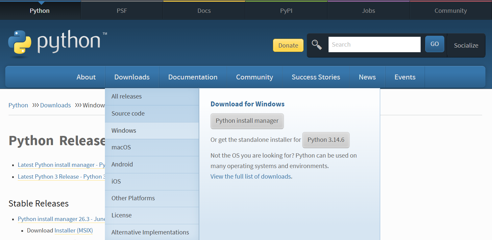{fig-align="center"}

---

## Veremos algo así {.imagen}

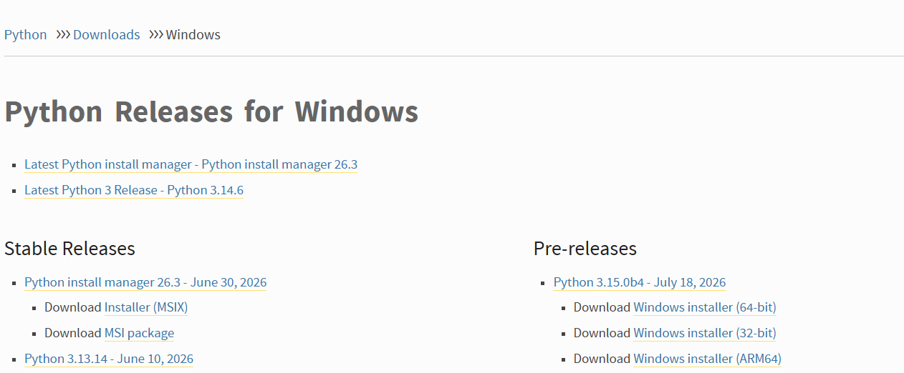{fig-align="center"}

::: {.piefoto}
La lista de versiones de Python para Windows: las estables arriba y las
preliminares a la derecha.
:::

---

## ¿Qué versión elegir? {.imagen}

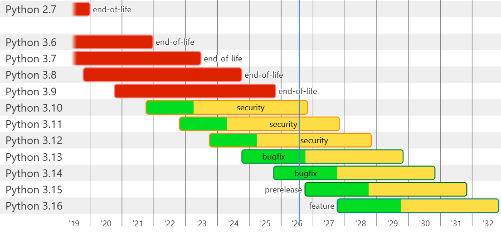{fig-align="center"}

::: {.piefoto}
Ciclo de vida de cada versión de Python. Verde = corrección de errores,
amarillo = solo parches de seguridad, rojo = sin soporte.
:::

---

## Paso 3 · Escoger una versión

::: {.concepto}
Mi recomendación es **Python 3.12**, porque está en etapa *security*: eso
significa que **aún tiene soporte** y que **ya pasó la etapa de corrección de
errores**.
:::

Es decir, es una versión madura y estable. Las más nuevas todavía están
puliendo fallos; las más viejas ya no reciben parches.

::: {.destacado}
Una versión muy reciente suele traer problemas de compatibilidad con las
librerías científicas, que tardan meses en adaptarse.
:::

---

## Enlace directo a la versión recomendada {.imagen}

Si van a usar la recomendada, pueden ir directamente a
**<https://www.python.org/downloads/release/python-31210/>** o escanear este QR.

{fig-align="center"}

---

## Paso 4 · Elegir el instalador {.imagen}

Bajamos hasta el final de la página de la versión elegida y damos clic al
instalador que queremos. Para equipos comunes: **"Windows installer (64-bit)"**.

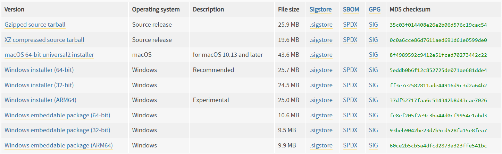{fig-align="center"}

---

## Paso 5 · Abrir la descarga {.imagen}

Ya que descargó, damos **doble clic** en el archivo.

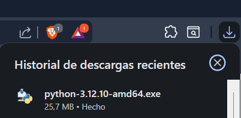{fig-align="center"}

---

## Paso 6 · El paso que más se olvida {.imagen}

::: {.columns}
::: {.column width="46%"}
::: {.alerta}
Marquen **"Add python.exe to PATH"** *antes* de instalar.
:::

Sin esa casilla, Windows no sabrá dónde está Python y los comandos `python` y
`pip` **no funcionarán** desde la terminal.

Después, clic en **"Install now"**.
:::
::: {.column width="54%"}
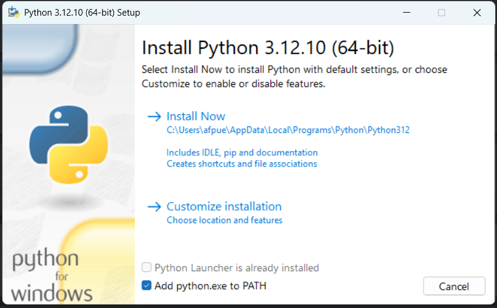{fig-align="center"}
:::
:::

---

## Paso 7 · Esperar

La instalación tarda un par de minutos. No cierren la ventana hasta que
aparezca el mensaje de finalización.

---

## Paso 8 · Comprobar que quedó instalado

Abrimos la terminal y ejecutamos:

```{=html}
<div class="terminal" data-copy="python --version">
<pre><span class="prompt">C:\Users\afpue&gt;</span>python --version</pre>
</div>
```

Se debe ver así:

```{=html}
<div class="terminal" data-copy="python --version">
<pre><span class="prompt">C:\Users\afpue&gt;</span>python --version
<span class="salida">Python 3.12.10</span></pre>
</div>
```

::: {.destacado}
Si en vez de la versión aparece *"python no se reconoce como un comando"*,
casi siempre es que faltó marcar **Add python.exe to PATH** en el paso 6.
:::

---

## Instalar librerías

Ya tenemos Python. Para instalar las librerías que necesitemos se usa el
comando `pip install`, así:

```{=html}
<div class="terminal" data-copy="pip install nombre_libreria">
<pre><span class="prompt">C:\Users\afpue&gt;</span>pip install nombre_libreria</pre>
</div>
```

::: {.destacado}
`pip` es el gestor de paquetes de Python y viene incluido con la instalación.
No hay que instalarlo aparte.
:::

---

## Las librerías del curso

Este es el comando con las librerías que posiblemente necesitemos:

```{=html}
<div class="terminal" data-copy="pip install numpy pandas matplotlib seaborn scipy scikit-learn statsmodels jupyter">
<pre><span class="prompt">C:\Users\afpue&gt;</span>pip install numpy pandas matplotlib seaborn scipy scikit-learn statsmodels jupyter</pre>
</div>
```

::: {.tarjetas}
::: {.tarjeta}
**Datos**
`numpy` · `pandas` — arreglos numéricos y tablas.
:::
::: {.tarjeta}
**Gráficos**
`matplotlib` · `seaborn` — visualización.
:::
::: {.tarjeta}
**Modelos**
`scipy` · `scikit-learn` · `statsmodels` — estadística y machine learning.
:::
::: {.tarjeta}
**Entorno**
`jupyter` — cuadernos interactivos.
:::
:::

# 2 · Visual Studio Code {.seccion background-color="#1553ad"}

---

## ¿Por qué un editor?

Ya que tenemos Python, vamos a instalar un **IDE** que nos permita tener
extensiones y complementos que faciliten la programación.

::: {.concepto}
Personalmente recomiendo **Visual Studio Code**, pero el código programado
debe funcionar **independientemente del IDE** utilizado.
:::

---

## Enlace y QR {.imagen}

Pueden acceder a él desde **<https://code.visualstudio.com/>** o este QR.

{fig-align="center"}

---

## Paso 1 · Descargar {.imagen}

Damos clic en **"Download for Windows"** si es el caso; si no, clic en
**"Other platforms"**.

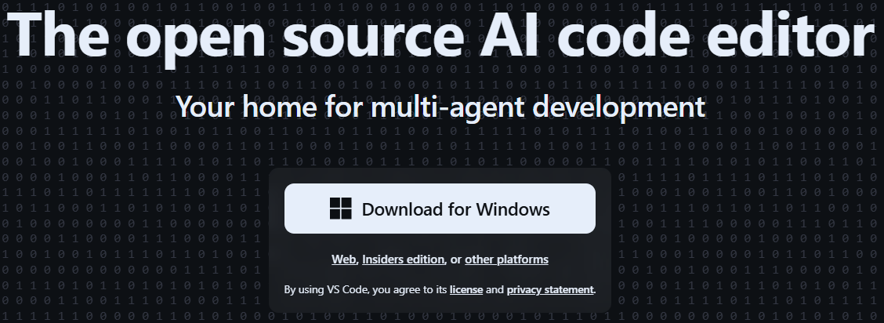{fig-align="center"}

---

## Paso 2 · Abrir la descarga {.imagen}

Le damos **doble clic** a la descarga.

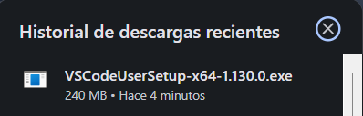{fig-align="center"}

---

## Paso 3 · Acuerdo de licencia {.imagen}

Aceptamos los acuerdos de licencia y clic en **"Siguiente"**.

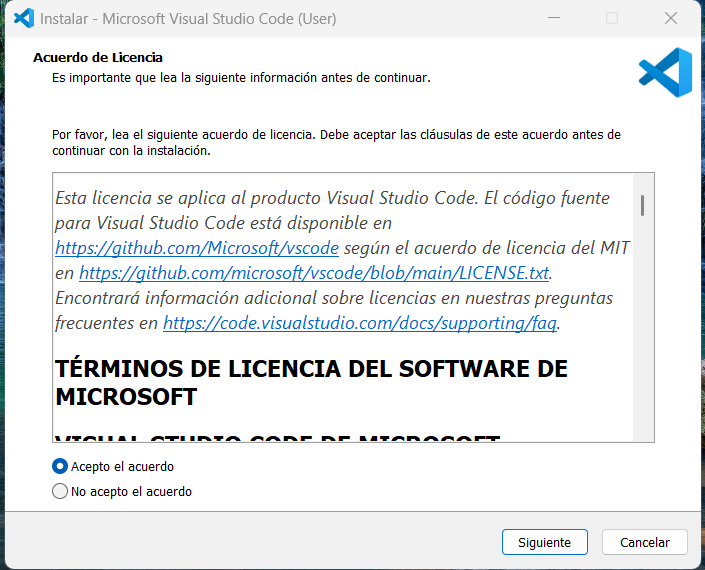{fig-align="center"}

---

## Paso 4 · Opciones de instalación {.imagen}

Agregamos a **PATH** y escogemos las demás opciones que deseen.

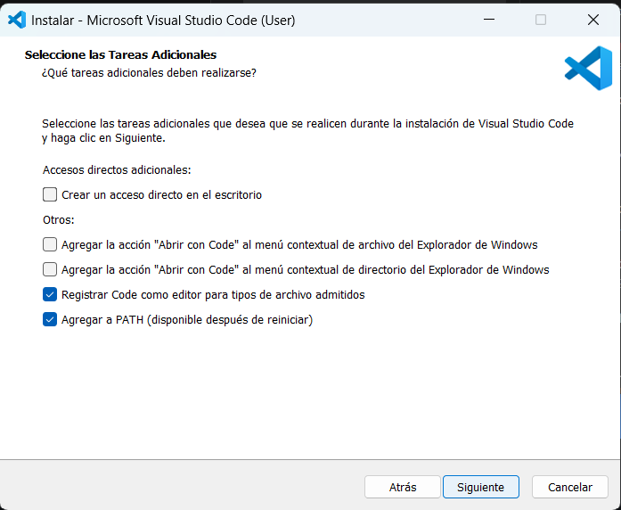{fig-align="center"}

---

## Paso 5 · Instalar y esperar {.imagen}

Ya solo le damos en instalar y esperamos.

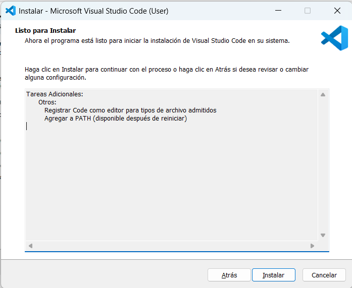{fig-align="center"}

---

## Paso 6 · Abrir el editor {.imagen}

Ya solo lo abrimos y podemos empezar a crear archivos.

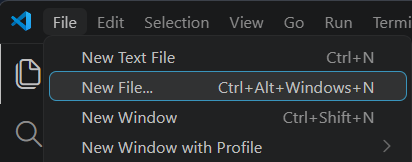{fig-align="center"}

# Comprobación final {.seccion background-color="#1553ad"}

---

## Antes de irse, verifiquen esto

Abran la terminal y ejecuten los tres comandos. Si los tres responden, están listos:

```{=html}
<div class="terminal" data-copy="python --version
pip --version
python -c &quot;import numpy, pandas, sklearn; print('Todo listo')&quot;">
<pre><span class="prompt">C:\Users\afpue&gt;</span>python --version
<span class="prompt">C:\Users\afpue&gt;</span>pip --version
<span class="prompt">C:\Users\afpue&gt;</span>python -c "import numpy, pandas, sklearn; print('Todo listo')"</pre>
</div>
```

El último debe responder:

```{=html}
<div class="terminal" data-copy="python -c &quot;import numpy, pandas, sklearn; print('Todo listo')&quot;">
<pre><span class="prompt">C:\Users\afpue&gt;</span>python -c "import numpy, pandas, sklearn; print('Todo listo')"
<span class="salida">Todo listo</span></pre>
</div>
```

---

## Si algo falla

::: {.tarjetas}
::: {.tarjeta}
**"python no se reconoce como un comando"**
Faltó marcar *Add python.exe to PATH*. Se arregla reinstalando y marcando la
casilla, o añadiendo Python al PATH a mano.
:::
::: {.tarjeta}
**El comando funciona pero `pip` no**
Prueben con `python -m pip install ...` en lugar de `pip install ...`.
:::
::: {.tarjeta}
**Abrí la terminal antes de instalar**
Ciérrenla y ábranla de nuevo: el PATH solo se actualiza en ventanas nuevas.
:::
::: {.tarjeta}
**Error al compilar una librería**
Suele pasar con versiones de Python muy recientes. Es el motivo de recomendar
la 3.12.
:::
:::

# ¿Preguntas? {.seccion background-color="#1553ad"}

Si a alguien no le funcionó, lo resolvemos ahora

[afpuertav.github.io](https://afpuertav.github.io/)
