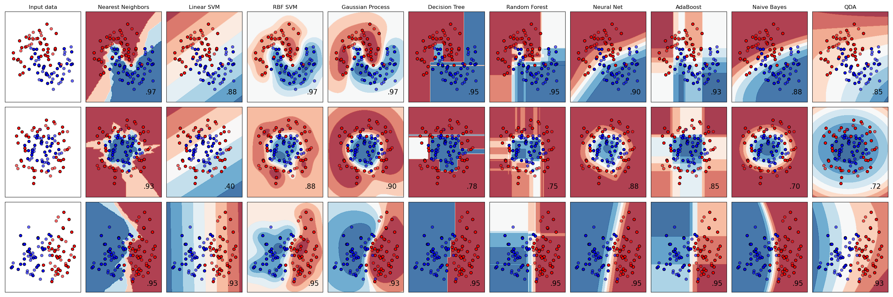
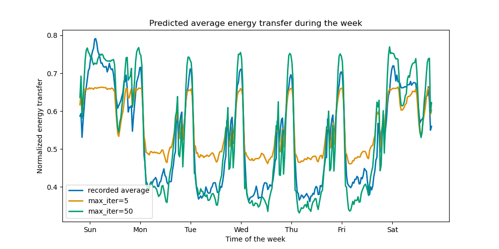
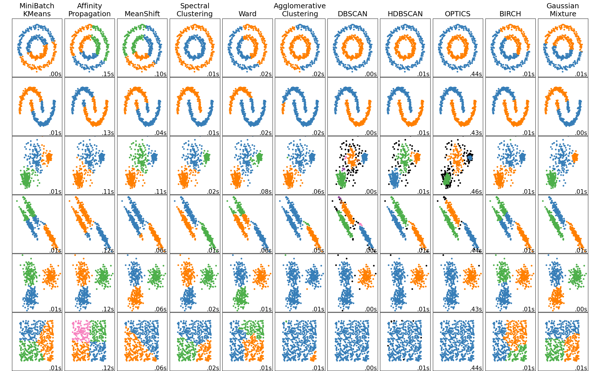
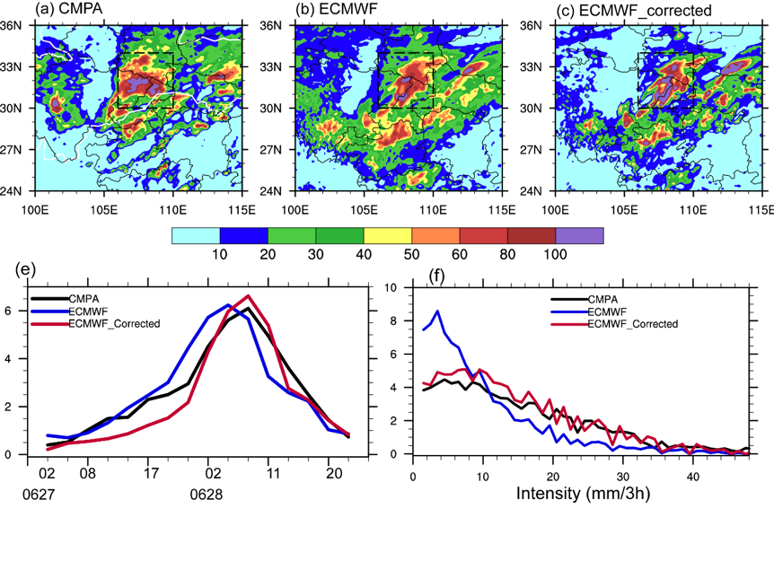
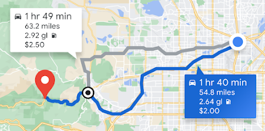

# Sesión 1 {.seccion background-color="#1553ad"}

De qué hablamos cuando hablamos de "inteligencia artificial"

---

## Qué veremos hoy

1. **Inteligencia artificial** — qué es, qué no es, y de dónde viene el término.
2. **Machine learning** — en qué se diferencia de programar "a mano".
3. **Paradigmas** — supervisado, no supervisado, semisupervisado, por refuerzo.
4. **Tipos de tarea** — clasificación, regresión, clustering.
5. **Aplicaciones** — dónde se usa esto de verdad.
6. **Hacia dónde va el curso** — por qué nos centraremos en regresión.

Hoy **no** habrá código ni matemáticas. La idea es construir el mapa mental
completo antes de entrar en las fórmulas y en Python.

# 1 · ¿Qué es la inteligencia artificial? {.seccion background-color="#1553ad"}

---

## Una definición oficial

::: {.concepto}
Un **sistema de IA** es *"un sistema basado en máquinas que, para objetivos
explícitos o implícitos, infiere, a partir de la entrada que recibe, cómo
generar salidas tales como predicciones, contenido, recomendaciones o
decisiones que pueden influir en entornos físicos o virtuales"*.
:::

Los sistemas de IA **varían en su nivel de autonomía y de adaptabilidad**
después de ser desplegados.

::: {.fuente}
OCDE (2023). *Explanatory memorandum on the updated OECD definition of an AI system*.
<https://oecd.ai/en/dashboards/policy-initiatives/updated-oecd-definition-of-an-ai-system-4108>
:::

---

## Por qué esa definición es tan cuidadosa

Es la definición que adoptaron los países miembros de la OCDE en 2023 y la que
sirve de base a buena parte de la regulación actual sobre IA.

::: {.tarjetas}
::: {.tarjeta}
**"Infiere"**
No basta con seguir reglas fijas: el sistema deriva algo que no estaba escrito
explícitamente.
:::
::: {.tarjeta}
**"Objetivos implícitos"**
El objetivo puede no estar declarado; puede estar embebido en los datos.
:::
::: {.tarjeta}
**"Adaptabilidad"**
El sistema puede cambiar su comportamiento después de haber sido desplegado.
:::
:::

Fíjense en lo que **no** dice: no menciona redes neuronales, ni Python, ni
grandes volúmenes de datos.

::: {.fuente}
OCDE (2023). *Updated OECD Definition of an AI system*.
<https://oecd.ai/en/dashboards/policy-initiatives/updated-oecd-definition-of-an-ai-system-4108>
:::

---

## IA no es lo mismo que machine learning

```{=html}
<svg viewBox="0 0 1120 480" style="width:100%;max-height:530px" role="img"
     aria-label="Tres marcos anidados: inteligencia artificial contiene machine learning, que contiene aprendizaje profundo">

  <rect x="4"   y="4"   width="1112" height="472" rx="16" fill="#dce8f5" stroke="#1553ad" stroke-width="3"/>
  <rect x="150" y="96"  width="900"  height="352" rx="14" fill="#9dc0e6" stroke="#1553ad" stroke-width="3"/>
  <rect x="300" y="188" width="700"  height="240" rx="12" fill="#1553ad" stroke="#0f3f83" stroke-width="3"/>

  <text x="34"  y="46" font-size="30" font-weight="700" fill="#0f3f83">Inteligencia artificial</text>
  <text x="34"  y="76" font-size="19" fill="#31506f">Sistemas de reglas, búsqueda, lógica, planificación…</text>

  <text x="180" y="140" font-size="27" font-weight="700" fill="#0f3f83">Machine learning</text>
  <text x="180" y="170" font-size="19" fill="#31506f">Aprende los patrones a partir de los datos</text>

  <text x="330" y="252" font-size="25" font-weight="700" fill="#ffffff">Aprendizaje profundo</text>
  <text x="330" y="286" font-size="18" fill="#dce8f5">Redes neuronales de muchas capas</text>
</svg>
```

::: {.subtitulo}
Todo el machine learning es IA, pero no toda la IA es machine learning.
:::

::: {.fuente}
IBM. *¿Qué es el machine learning (ML)?* —
<https://www.ibm.com/mx-es/think/topics/machine-learning>
:::

# 2 · ¿Qué es el machine learning? {.seccion background-color="#1553ad"}

---

## Definición

::: {.concepto}
El machine learning es el **subconjunto de la inteligencia artificial centrado
en algoritmos que pueden "aprender" los patrones de los datos de entrenamiento**
y, posteriormente, hacer inferencias precisas sobre datos nuevos.
:::

Esa capacidad de reconocimiento de patrones permite que los modelos **tomen
decisiones o predicciones sin instrucciones explícitas y codificadas**.

En palabras de Google: el ML es el proceso de **entrenar un programa —llamado
*modelo*— para hacer predicciones útiles o generar contenido a partir de datos**.

::: {.fuente}
IBM. *¿Qué es el machine learning (ML)?* — <https://www.ibm.com/mx-es/think/topics/machine-learning> ·
Google for Developers. *What is Machine Learning?* — <https://developers.google.com/machine-learning/intro-to-ml/what-is-ml>
:::

---

## El cambio de enfoque

```{=html}
<svg viewBox="0 0 1100 400" style="width:100%;max-height:460px" role="img"
     aria-label="Comparación: en programación tradicional datos y reglas entran a un programa que produce respuestas; en machine learning datos y respuestas entran al entrenamiento que produce un modelo, y el modelo produce respuestas nuevas">

  <defs>
    <marker id="fg" markerWidth="10" markerHeight="10" refX="8" refY="5" orient="auto">
      <path d="M0 0 L10 5 L0 10 z" fill="#7d8a97"/>
    </marker>
    <marker id="fa" markerWidth="10" markerHeight="10" refX="8" refY="5" orient="auto">
      <path d="M0 0 L10 5 L0 10 z" fill="#1553ad"/>
    </marker>
  </defs>

  <!-- ── PROGRAMACIÓN TRADICIONAL ── -->
  <text x="10" y="26" font-size="23" font-weight="700" fill="#5a6774">Programación tradicional</text>

  <rect x="10"  y="46"  width="170" height="56" rx="9" fill="#fff" stroke="#7d8a97" stroke-width="2.5"/>
  <text x="95"  y="82"  font-size="20" text-anchor="middle" fill="#2c3e50">Datos</text>

  <rect x="10"  y="118" width="170" height="56" rx="9" fill="#fff" stroke="#7d8a97" stroke-width="2.5"/>
  <text x="95"  y="154" font-size="20" text-anchor="middle" fill="#2c3e50">Reglas</text>

  <path d="M188 74  L250 100" stroke="#7d8a97" stroke-width="3" fill="none" marker-end="url(#fg)"/>
  <path d="M188 146 L250 120" stroke="#7d8a97" stroke-width="3" fill="none" marker-end="url(#fg)"/>

  <rect x="258" y="82"  width="180" height="56" rx="9" fill="#7d8a97"/>
  <text x="348" y="118" font-size="20" text-anchor="middle" fill="#fff">Programa</text>

  <path d="M446 110 L508 110" stroke="#7d8a97" stroke-width="3" marker-end="url(#fg)"/>

  <rect x="516" y="82"  width="180" height="56" rx="9" fill="#fff" stroke="#7d8a97" stroke-width="2.5"/>
  <text x="606" y="118" font-size="20" text-anchor="middle" fill="#2c3e50">Respuestas</text>

  <line x1="10" y1="205" x2="1090" y2="205" stroke="#cdd7d6" stroke-width="2" stroke-dasharray="8 6"/>

  <!-- ── MACHINE LEARNING ── -->
  <text x="10" y="243" font-size="23" font-weight="700" fill="#0f3f83">Machine learning</text>

  <rect x="10"  y="263" width="170" height="56" rx="9" fill="#fff" stroke="#1553ad" stroke-width="2.5"/>
  <text x="95"  y="299" font-size="20" text-anchor="middle" fill="#2c3e50">Datos</text>

  <rect x="10"  y="335" width="170" height="56" rx="9" fill="#fff" stroke="#1553ad" stroke-width="2.5"/>
  <text x="95"  y="371" font-size="20" text-anchor="middle" fill="#2c3e50">Respuestas</text>

  <path d="M188 291 L250 317" stroke="#1553ad" stroke-width="3" fill="none" marker-end="url(#fa)"/>
  <path d="M188 363 L250 337" stroke="#1553ad" stroke-width="3" fill="none" marker-end="url(#fa)"/>

  <rect x="258" y="299" width="180" height="56" rx="9" fill="#1553ad"/>
  <text x="348" y="335" font-size="20" text-anchor="middle" fill="#fff">Entrenamiento</text>

  <path d="M446 327 L508 327" stroke="#1553ad" stroke-width="3" marker-end="url(#fa)"/>

  <rect x="516" y="297" width="180" height="60" rx="9" fill="#fff" stroke="#1553ad" stroke-width="4"/>
  <text x="606" y="334" font-size="21" text-anchor="middle" fill="#0f3f83" font-weight="700">Modelo</text>

  <path d="M704 327 L766 327" stroke="#1553ad" stroke-width="3" marker-end="url(#fa)"/>

  <rect x="774" y="299" width="200" height="56" rx="9" fill="#dce8f5" stroke="#1553ad" stroke-width="2.5"/>
  <text x="874" y="329" font-size="19" text-anchor="middle" fill="#0f3f83">Respuestas</text>
  <text x="874" y="348" font-size="14" text-anchor="middle" fill="#31506f">para datos nuevos</text>
</svg>
```

En la programación clásica escribimos las **reglas**. En machine learning damos
**ejemplos resueltos** y el algoritmo deduce las reglas por su cuenta.

::: {.fuente}
Google for Developers. *What is Machine Learning?* —
<https://developers.google.com/machine-learning/intro-to-ml/what-is-ml>
:::

---

## Un ejemplo concreto: predecir la lluvia

::: {.columns}
::: {.column width="48%"}
::: {.tarjeta}
**Enfoque tradicional**

Construir una representación física de la atmósfera y la superficie terrestre,
y resolver enormes cantidades de ecuaciones de dinámica de fluidos.

*Google lo describe como "increíblemente difícil".*
:::
:::
::: {.column width="4%"}
:::
::: {.column width="48%"}
::: {.tarjeta}
**Enfoque de machine learning**

Darle al modelo grandes cantidades de datos meteorológicos históricos hasta que
aprenda la relación entre los patrones del clima y la cantidad de lluvia.

Después le damos el clima actual y predice la lluvia.
:::
:::
:::

Ninguno de los dos es "mejor" siempre. El ML gana cuando la relación es
**difícil de escribir a mano pero está presente en los datos**.

::: {.fuente}
Google for Developers. *What is Machine Learning?* —
<https://developers.google.com/machine-learning/intro-to-ml/what-is-ml>
:::

---

## Tres palabras que usaremos todo el curso

::: {.tarjetas}
::: {.tarjeta}
**Modelo**
La relación matemática derivada de los datos que el sistema usa para predecir.
No es un programa escrito por nosotros: es el resultado del entrenamiento.
:::
::: {.tarjeta}
**Entrenamiento**
El proceso de ajustar el modelo mostrándole datos.
:::
::: {.tarjeta}
**Inferencia / predicción**
Usar el modelo ya entrenado sobre datos **nuevos**, que nunca vio.
:::
:::

::: {.fuente}
Google for Developers. *What is Machine Learning?* — <https://developers.google.com/machine-learning/intro-to-ml/what-is-ml> ·
IBM. *¿Qué es el machine learning (ML)?* — <https://www.ibm.com/mx-es/think/topics/machine-learning>
:::

# 3 · Paradigmas de aprendizaje {.seccion background-color="#1553ad"}

---

## Los tres paradigmas fundamentales

Todos los métodos de machine learning pueden clasificarse en uno de tres
paradigmas, según **la naturaleza de sus objetivos de entrenamiento**.

::: {.tarjetas}
::: {.tarjeta}
[Supervisado]{.etiqueta}

Entrena un modelo para predecir la salida **correcta** para una entrada dada.
Requiere una "verdad fundamental" externa.
:::
::: {.tarjeta}
[No supervisado]{.etiqueta .etiqueta-gris}

Entrena un modelo para **descubrir patrones intrínsecos**, dependencias y
correlaciones. No hay respuesta correcta contra la cual comparar.
:::
::: {.tarjeta}
[Por refuerzo]{.etiqueta .etiqueta-amarilla}

Entrena un modelo para **evaluar su entorno y actuar** buscando la mayor
recompensa. No hay una verdad única, pero sí acciones buenas y malas.
:::
:::

::: {.fuente}
IBM. *¿Qué es el machine learning (ML)?* —
<https://www.ibm.com/mx-es/think/topics/machine-learning>
:::

---

## Aprendizaje supervisado

::: {.concepto}
El modelo aprende a partir de datos **que ya traen la respuesta correcta**
(datos *etiquetados*).
:::

Google lo compara con un estudiante que se prepara estudiando exámenes antiguos
que incluyen tanto las preguntas **como** las respuestas. Cuando ha practicado
con suficientes exámenes viejos, está listo para uno nuevo.

Es "supervisado" en el sentido de que **un humano le entrega al sistema datos
con los resultados correctos ya conocidos**. Sus dos casos de uso más comunes
son **regresión** y **clasificación**.

::: {.fuente}
Google for Developers. *What is Machine Learning?* —
<https://developers.google.com/machine-learning/intro-to-ml/what-is-ml>
:::

---

## Aprendizaje no supervisado

::: {.concepto}
Los algoritmos **disciernen patrones intrínsecos en datos no etiquetados**:
similitudes, correlaciones o agrupaciones potenciales.
:::

Son especialmente útiles cuando esos patrones **no son evidentes para un
observador humano**.

Como no se asume la preexistencia de una salida "correcta" conocida, no
requieren señales de supervisión ni funciones de pérdida convencionales — de
ahí el nombre.

::: {.fuente}
IBM. *¿Qué es el machine learning (ML)?* —
<https://www.ibm.com/mx-es/think/topics/machine-learning>
:::

---

## Aprendizaje semisupervisado

::: {.concepto}
Usa **tanto datos etiquetados como datos no etiquetados**.
:::

La idea: aprovechar la información de los pocos datos etiquetados disponibles
para hacer suposiciones sobre los puntos **no** etiquetados, de modo que estos
últimos puedan incorporarse al flujo de trabajo supervisado.

**Por qué existe:** etiquetar datos es caro y lento. Un radiólogo marcando
tumores en diez mil imágenes cuesta muchísimo; conseguir diez mil imágenes sin
marcar es barato.

En scikit-learn esto aparece como *Self Training* y *Label Propagation*.

::: {.fuente}
IBM. *¿Qué es el machine learning (ML)?* — <https://www.ibm.com/mx-es/think/topics/machine-learning> ·
scikit-learn. *1.14. Semi-supervised learning* — <https://scikit-learn.org/stable/modules/semi_supervised.html>
:::

---

## Aprendizaje por refuerzo

::: {.concepto}
El modelo aprende **por prueba y error**, recibiendo recompensas o penalizaciones
según las acciones que realiza dentro de un entorno.
:::

En lugar de pares independientes de entrada-salida, opera sobre tuplas
interdependientes de **estado – acción – recompensa**. El objetivo no es
minimizar un error, sino **maximizar la recompensa**.

Se usa sobre todo en robótica, videojuegos y problemas donde el espacio de
soluciones es muy amplio o difícil de definir. Al sistema se le suele llamar
**agente**.

*Ejemplos: enseñar a un robot a caminar; AlphaGo aprendiendo a jugar Go.*

::: {.fuente}
IBM. *¿Qué es el machine learning (ML)?* — <https://www.ibm.com/mx-es/think/topics/machine-learning> ·
Google for Developers. *What is Machine Learning?* — <https://developers.google.com/machine-learning/intro-to-ml/what-is-ml>
:::

---

## Y además: IA generativa

::: {.concepto}
Una clase de modelos que **crea contenido** a partir de la entrada del usuario:
texto, imágenes, audio, video, código.
:::

Aprenden patrones de los datos con el objetivo de **producir datos nuevos pero
similares**. Google los compara con un comediante que imita a otros
observándolos, o con una banda tributo que aprende a sonar como un grupo
escuchando muchas de sus canciones.

Los modelos generativos se entrenan **inicialmente con un enfoque no
supervisado**, y a veces se afinan después con aprendizaje supervisado o por
refuerzo. No es un cuarto paradigma aislado, sino una combinación.

::: {.fuente}
Google for Developers. *What is Machine Learning?* —
<https://developers.google.com/machine-learning/intro-to-ml/what-is-ml>
:::

---

## Resumen de paradigmas

| Paradigma | ¿Datos etiquetados? | ¿Qué optimiza? | Tareas típicas |
|---|---|---|---|
| **Supervisado** | Sí | Acercarse a la respuesta correcta | Clasificación, regresión |
| **Semisupervisado** | Algunos sí, la mayoría no | Igual, aprovechando lo no etiquetado | Clasificación con pocos datos |
| **No supervisado** | No | Estructura interna de los datos | Clustering, asociación, reducción de dimensionalidad |
| **Por refuerzo** | No aplica | Maximizar recompensa acumulada | Control, robótica, juegos |

::: {.fuente}
IBM. *¿Qué es el machine learning (ML)?* — <https://www.ibm.com/mx-es/think/topics/machine-learning> ·
Google for Developers. *What is Machine Learning?* — <https://developers.google.com/machine-learning/intro-to-ml/what-is-ml>
:::

# 4 · Tipos de tarea {.seccion background-color="#1553ad"}

---

## Las tres tareas más comunes

```{=html}
<svg viewBox="0 0 960 300" style="width:100%;max-height:380px" role="img"
     aria-label="Tres gráficos: clasificación con frontera, regresión con recta ajustada, clustering con grupos">
  <text x="20" y="22" font-size="17" font-weight="700" fill="#0f3f83">Clasificación</text>
  <rect x="20" y="34" width="270" height="220" fill="#fff" stroke="#cdd7d6" stroke-width="2" rx="6"/>
  <line x1="40" y1="240" x2="272" y2="70" stroke="#cc2936" stroke-width="3" stroke-dasharray="7 5"/>
  <g fill="#1553ad">
    <circle cx="70" cy="90" r="8"/><circle cx="105" cy="70" r="8"/><circle cx="95" cy="120" r="8"/>
    <circle cx="140" cy="95" r="8"/><circle cx="60" cy="140" r="8"/><circle cx="125" cy="135" r="8"/>
  </g>
  <g fill="#f1c40f" stroke="#b8960b" stroke-width="1.5">
    <rect x="185" y="180" width="15" height="15"/><rect x="225" y="205" width="15" height="15"/>
    <rect x="160" y="215" width="15" height="15"/><rect x="245" y="165" width="15" height="15"/>
    <rect x="205" y="150" width="15" height="15"/><rect x="140" y="190" width="15" height="15"/>
  </g>
  <text x="30" y="277" font-size="13" fill="#5a6774">Salida: una categoría</text>

  <text x="345" y="22" font-size="17" font-weight="700" fill="#0f3f83">Regresión</text>
  <rect x="345" y="34" width="270" height="220" fill="#fff" stroke="#cdd7d6" stroke-width="2" rx="6"/>
  <line x1="365" y1="228" x2="597" y2="72" stroke="#1553ad" stroke-width="3.5"/>
  <g fill="#2c3e50">
    <circle cx="390" cy="222" r="6"/><circle cx="425" cy="192" r="6"/><circle cx="452" cy="185" r="6"/>
    <circle cx="486" cy="152" r="6"/><circle cx="515" cy="140" r="6"/><circle cx="548" cy="105" r="6"/>
    <circle cx="575" cy="95" r="6"/><circle cx="410" cy="215" r="6"/><circle cx="530" cy="122" r="6"/>
  </g>
  <text x="355" y="277" font-size="13" fill="#5a6774">Salida: un número continuo</text>

  <text x="670" y="22" font-size="17" font-weight="700" fill="#0f3f83">Clustering</text>
  <rect x="670" y="34" width="270" height="220" fill="#fff" stroke="#cdd7d6" stroke-width="2" rx="6"/>
  <ellipse cx="740" cy="105" rx="52" ry="45" fill="none" stroke="#8a97a4" stroke-width="2" stroke-dasharray="5 4"/>
  <ellipse cx="865" cy="195" rx="52" ry="45" fill="none" stroke="#8a97a4" stroke-width="2" stroke-dasharray="5 4"/>
  <g fill="#2176ae">
    <circle cx="720" cy="90" r="7"/><circle cx="755" cy="80" r="7"/><circle cx="738" cy="118" r="7"/>
    <circle cx="765" cy="120" r="7"/><circle cx="712" cy="122" r="7"/>
    <circle cx="850" cy="180" r="7"/><circle cx="885" cy="172" r="7"/><circle cx="862" cy="212" r="7"/>
    <circle cx="890" cy="210" r="7"/><circle cx="838" cy="205" r="7"/>
  </g>
  <text x="680" y="277" font-size="13" fill="#5a6774">Salida: grupos que nadie definió</text>
</svg>
```

::: {.fuente}
Google for Developers. *What is Machine Learning?* — <https://developers.google.com/machine-learning/intro-to-ml/what-is-ml> ·
IBM. *¿Qué es el machine learning (ML)?* — <https://www.ibm.com/mx-es/think/topics/machine-learning>
:::

---

## Clasificación

::: {.concepto}
Un modelo de clasificación predice **la probabilidad de que algo pertenezca a
una categoría**. A diferencia de la regresión, su salida no es un número sino
una pertenencia.
:::

::: {.columns}
::: {.column width="50%"}
**Binaria** — dos valores posibles

*Ejemplos:* ¿este correo es spam o no?
¿va a llover o no?
:::
::: {.column width="50%"}
**Multiclase** — más de dos valores

*Ejemplos:* ¿esta foto contiene un gato, un perro o un pájaro?
¿lluvia, granizo, nieve o aguanieve?
:::
:::

::: {.fuente}
Google for Developers. *What is Machine Learning?* —
<https://developers.google.com/machine-learning/intro-to-ml/what-is-ml>
:::

---

## Clasificación: cómo se ve de verdad {.imagen}

{fig-align="center" width="98%"}

::: {.piefoto}
Distintos clasificadores sobre los mismos tres conjuntos de datos. Cada color
de fondo es la región que el modelo asigna a cada clase; el número es su
exactitud. Fíjense en que **el mismo dato admite fronteras muy distintas**.
:::

::: {.fuente}
scikit-learn developers. *Classifier comparison* —
<https://scikit-learn.org/stable/auto_examples/classification/plot_classifier_comparison.html>
:::

---

## Regresión

::: {.concepto}
Un modelo de regresión predice **un valor numérico**.
:::

Los modelos de regresión predicen valores continuos: precio, duración,
temperatura, tamaño.

| Escenario | Datos de entrada posibles | Predicción numérica |
|---|---|---|
| Precio futuro de una vivienda | Metros cuadrados, código postal, número de habitaciones y baños, tamaño del lote, tasa de interés hipotecario, impuestos | El precio de la vivienda |
| Duración futura de un trayecto | Condiciones históricas de tráfico, distancia al destino, condiciones meteorológicas | El tiempo hasta llegar |

::: {.fuente}
Google for Developers. *What is Machine Learning?* — <https://developers.google.com/machine-learning/intro-to-ml/what-is-ml> ·
IBM. *¿Qué es el machine learning (ML)?* — <https://www.ibm.com/mx-es/think/topics/machine-learning>
:::

---

## Regresión: cómo se ve de verdad {.imagen}

{fig-align="center" width="82%"}

::: {.piefoto}
Predicción del consumo eléctrico a lo largo de la semana. La línea azul es lo
que ocurrió; naranja y verde son dos modelos con distinto grado de ajuste.
**La salida es un número para cada instante**, no una categoría.
:::

::: {.fuente}
scikit-learn developers. *Time-related feature engineering* —
<https://scikit-learn.org/stable/auto_examples/applications/plot_cyclical_feature_engineering.html>
:::

---

## Clustering y otras tareas no supervisadas

La mayoría de los métodos no supervisados hacen una de estas tres cosas:

::: {.tarjetas}
::: {.tarjeta}
**Agrupación (clustering)**
Divide los puntos en grupos según su proximidad o similitud.
*Usos: segmentación de mercado, detección de fraude.*
Algoritmos: k-means, mezclas gaussianas, DBSCAN.
:::
::: {.tarjeta}
**Asociación**
Distingue correlaciones entre acciones y condiciones.
*Usos: motores de recomendación de comercio electrónico.*
:::
::: {.tarjeta}
**Reducción de dimensionalidad**
Representa los datos con menos características conservando lo significativo.
*Usos: preprocesamiento, compresión, visualización.*
Algoritmos: PCA, LDA, t-SNE, autocodificadores.
:::
:::

El clustering **se diferencia de la clasificación** en que las categorías no las
define uno: el modelo agrupa, y darles nombre es trabajo del humano después.

::: {.fuente}
IBM. *¿Qué es el machine learning (ML)?* — <https://www.ibm.com/mx-es/think/topics/machine-learning> ·
Google for Developers. *What is Machine Learning?* — <https://developers.google.com/machine-learning/intro-to-ml/what-is-ml>
:::

---

## Clustering: cómo se ve de verdad {.imagen}

{fig-align="center" width="80%"}

::: {.piefoto}
Once algoritmos de agrupación sobre seis conjuntos de datos distintos. Ninguno
gana siempre: los círculos concéntricos de la primera fila derrotan a k-means y
los resuelve DBSCAN. **No existe el algoritmo universalmente mejor.**
:::

::: {.fuente}
scikit-learn developers. *Comparing different clustering algorithms on toy datasets* —
<https://scikit-learn.org/stable/auto_examples/cluster/plot_cluster_comparison.html>
:::

---

## Un mismo algoritmo, varias tareas

Muchos algoritmos de ML supervisado sirven **para clasificación y para
regresión**. El resultado de lo que nominalmente es un algoritmo de regresión
puede usarse después para fundamentar una predicción de clasificación.

En la documentación de scikit-learn, las **máquinas de vectores de soporte
(SVM)** tienen su propia sección de clasificación *y* su propia sección de
regresión. Lo mismo ocurre con los árboles de decisión y con los vecinos más
cercanos.

::: {.fuente}
IBM. *¿Qué es el machine learning (ML)?* — <https://www.ibm.com/mx-es/think/topics/machine-learning> ·
scikit-learn. *1.4. Support Vector Machines* — <https://scikit-learn.org/stable/modules/svm.html>
:::

# 5 · ¿Dónde se usa esto? {.seccion background-color="#1553ad"}

---

## Vehículos autónomos {.imagen}



::: {.piefoto}
Los vehículos autónomos son uno de los ejemplos que Google cita como
emblemáticos del machine learning.
:::

::: {.fuente}
Video propio · Google for Developers. *What is Machine Learning?* —
<https://developers.google.com/machine-learning/intro-to-ml/what-is-ml>
:::

---

## Predicción del clima {.imagen}

{fig-align="center" width="74%"}

::: {.piefoto}
Precipitación observada (a) frente a la predicción del modelo (b) y a la
predicción **corregida** (c). Corregir la salida de un modelo físico con datos
históricos es, en esencia, un problema de regresión.
:::

::: {.fuente}
Organización Meteorológica Mundial (OMM/WMO). *Desarrollo de la predicción meteorológica operativa
condicionada por las propiedades de la triple…* —
<https://wmo.int/es/media/magazine-article/desarrollo-de-la-prediccion-meteorologica-operativa-condicionada-por-las-propiedades-de-la-triple-de>
:::

---

## Tiempo de ruta {.imagen}

{fig-align="center" width="62%"}

::: {.piefoto}
Estimar cuánto tardará un trayecto a partir del tráfico histórico, la distancia
y las condiciones meteorológicas es **regresión pura**: la salida es un número
de minutos.
:::

::: {.fuente}
Google Maps Platform. *Ofrece rutas eficientes* —
<https://mapsplatform.google.com/intl/es-419_mx/solutions/offer-efficient-routes/>
:::

---

## Y muchas más

- **Traducción automática** — aplicaciones de traducción entre idiomas.
- **Recomendación** — sugerir canciones; motores de recomendación en comercio electrónico.
- **Texto** — autocompletar frases, resumir artículos.
- **Imágenes** — generar imágenes nunca antes vistas; mejorar fotos de producto y quitar fondos.
- **Negocio y riesgo** — segmentación de mercado y detección de fraude mediante clustering.
- **Salud** — apoyo al diagnóstico a partir de imágenes médicas.

::: {.fuente}
Google for Developers. *What is Machine Learning?* — <https://developers.google.com/machine-learning/intro-to-ml/what-is-ml> ·
IBM. *¿Qué es el machine learning (ML)?* — <https://www.ibm.com/mx-es/think/topics/machine-learning>
:::

---

## ¿Cuándo tiene sentido usar machine learning?

::: {.concepto}
Cuando existe un patrón, **no sabemos escribirlo como reglas explícitas**, y
tenemos datos suficientes que lo contienen.
:::

::: {.alerta}
**Cuándo *no*:** si el problema se resuelve con una fórmula conocida, con
reglas claras y estables, o si no hay datos representativos, un modelo de ML
añade complejidad, coste y opacidad sin ganar nada.
:::

::: {.fuente}
Elaboración propia a partir de Google for Developers,
*What is Machine Learning?* — <https://developers.google.com/machine-learning/intro-to-ml/what-is-ml>
:::

# 6 · Hacia dónde va este curso {.seccion background-color="#1553ad"}

---

## Nuestro recorrido

Nos concentraremos en **aprendizaje supervisado de regresión en Python**, con
**scikit-learn**, la librería estándar de machine learning clásico.

Empezaremos por la regresión lineal y sus variantes, y llegaremos a las
máquinas de vectores de soporte para regresión (SVR). Pero conviene que vean
desde hoy **cuántas familias de modelos de regresión existen**.

::: {.fuente}
scikit-learn developers. *1. Supervised learning* —
<https://scikit-learn.org/stable/supervised_learning.html>
:::

---

## Modelos de regresión en scikit-learn {.smaller}

::: {.tarjetas}
::: {.tarjeta}
**Modelos lineales**
Mínimos cuadrados ordinarios, Ridge, Lasso, Elastic-Net, LARS, regresión
bayesiana, regresión cuantílica, regresión polinómica.
:::
::: {.tarjeta}
**Regresión robusta**
RANSAC, Huber, Theil-Sen — para datos con valores atípicos.
:::
::: {.tarjeta}
**Máquinas de vectores de soporte**
SVR, con distintos núcleos (lineal, polinómico, RBF).
:::
::: {.tarjeta}
**Vecinos más cercanos**
Predice promediando los ejemplos más parecidos.
:::
::: {.tarjeta}
**Árboles de decisión**
Divide el espacio en regiones y predice un valor en cada una.
:::
::: {.tarjeta}
**Ensambles**
Bosques aleatorios, *gradient boosting*, AdaBoost, *bagging*, *stacking*.
:::
::: {.tarjeta}
**Procesos gaussianos**
Predicen un valor **y su incertidumbre**.
:::
::: {.tarjeta}
**Redes neuronales**
Perceptrón multicapa para regresión.
:::
::: {.tarjeta}
**Otros**
Kernel ridge, descenso de gradiente estocástico, regresión isotónica, PLS.
:::
:::

::: {.fuente}
scikit-learn developers. *1. Supervised learning* — <https://scikit-learn.org/stable/supervised_learning.html> ·
*1.1. Linear Models* — <https://scikit-learn.org/stable/modules/linear_model.html> ·
*1.4. Support Vector Machines* — <https://scikit-learn.org/stable/modules/svm.html>
:::

---

## Para cerrar

::: {.concepto}
1. La IA es **cualquier sistema que infiere salidas** a partir de entradas para
   cumplir un objetivo.
2. El machine learning es el subconjunto que **aprende esos patrones de los
   datos** en vez de recibirlos como reglas.
3. Hay tres paradigmas: **supervisado, no supervisado y por refuerzo** — más
   combinaciones como el semisupervisado y la IA generativa.
4. Las tareas más comunes son **clasificación, regresión y clustering**.
5. Este curso vive en la casilla **supervisado → regresión**.
:::

A partir de la próxima sesión sí habrá código y matemáticas.

---

## Referencias {.smaller}

**Definición de inteligencia artificial**

- OCDE (2023). *Explanatory memorandum on the updated OECD definition of an AI system*. OECD Artificial Intelligence Papers No. 8.
  <https://www.oecd.org/en/publications/explanatory-memorandum-on-the-updated-oecd-definition-of-an-ai-system_623da898-en.html>
- OECD.AI. *Updated OECD Definition of an AI system*.
  <https://oecd.ai/en/dashboards/policy-initiatives/updated-oecd-definition-of-an-ai-system-4108>

**Machine learning: conceptos y paradigmas**

- IBM. *¿Qué es el machine learning (ML)?* — <https://www.ibm.com/mx-es/think/topics/machine-learning>
- Google for Developers. *Machine Learning Crash Course — What is Machine Learning?*
  <https://developers.google.com/machine-learning/intro-to-ml/what-is-ml> *(licencia CC BY 4.0)*

**Algoritmos e implementación**

- scikit-learn developers. *1. Supervised learning* · *2. Unsupervised learning* · *1.4. Support Vector Machines* · *1.14. Semi-supervised learning*.
  <https://scikit-learn.org/stable/supervised_learning.html>
- scikit-learn developers. *Classifier comparison* · *Comparing clustering algorithms* · *Time-related feature engineering* (figuras).
  <https://scikit-learn.org/stable/auto_examples/index.html>

**Figuras de aplicaciones**

- OMM/WMO. *Desarrollo de la predicción meteorológica operativa…* — <https://wmo.int/es/media/magazine-article/desarrollo-de-la-prediccion-meteorologica-operativa-condicionada-por-las-propiedades-de-la-triple-de>
- Google Maps Platform. *Ofrece rutas eficientes* — <https://mapsplatform.google.com/intl/es-419_mx/solutions/offer-efficient-routes/>

::: {.smaller}
Consultado el 27 de julio de 2026.
:::

# Gracias {.seccion background-color="#1553ad"}

Preguntas

[afpuertav.github.io](https://afpuertav.github.io/)
