<!-- ============ 1 · PORTADA ============ -->
## {.dark data-state="dark" data-menu-title="Portada" background-color="#3F2F9E"}

::: {.z #hero}
PyCon Colombia 2026

NLP en la práctica

De la lingüística de corpus a RAG con Python

Taller de procesamiento de lenguaje natural en español, con un caso aplicado en salud.

<b>Biviana Suárez</b>Universidad EAFIT

<b>Dora Alzate</b>Universidad EAFIT

<b>Karen Gómez</b>Universidad EAFIT

<b>Andrés Puerta</b>Universidad EAFIT

Taller · Medellín, 26 julio 2026

:::

<!-- ============ 2 · DIVIDER 01 ============ -->
## {.dark data-state="dark" data-menu-title="01 · Introducción participativa" background-color="#3F2F9E"}

::: {.z}

01

Introducción participativa

Biviana

:::

<!-- ============ 3 · OBJETIVO ============ -->
## Objetivo del *workshop* {data-kicker="Objetivo del workshop · Biviana"}

Convertir texto en datos analizables usando Python y mostrar cómo una metodología de NLP puede adaptarse a distintos dominios:

📰
Columnas de opinión en medios colombianos.

🇪🇸
Corpus en español con desafíos lingüísticos propios.

🩺
Aplicaciones en salud y análisis de publicaciones tipo Twitter/X.

<h3>La idea central</h3>

No venimos a mostrar un <em>notebook</em>: venimos a mostrar cómo se construye una metodología interdisciplinaria.

<!-- ============ 4 · RUTA ============ -->
## Ruta de dos horas {data-kicker="Ruta de dos horas · Biviana"}

<b style="font-size:23.5px;">Introducción participativa</b>Biviana

<b style="font-size:23.5px;">¿Qué debe saber un científico de datos sobre lenguaje?</b>Dora

<b style="font-size:23.5px;">Pipeline NLP: del lenguaje a los datos</b>Karen

<b style="font-size:23.5px;">Caso de uso: tweets y aplicación en salud</b>Andrés

<b style="font-size:23.5px;">Práctica guiada en Python</b>Equipo

<b style="font-size:23.5px;">Cierre y conversación final</b>Biviana

<!-- ============ 5 · ANTES DE PROGRAMAR ============ -->
## Antes de programar: leer el problema {data-kicker="Introducción participativa · Biviana" .t28}

Si les entregáramos 100.000 textos sobre política, ciencia, salud o cultura, ¿qué preguntas podrían responder con Python?

<h3>Preguntas posibles</h3>
<ul class="golddot">
<li>¿De qué se habla?</li>
<li>¿Quiénes aparecen?</li>
<li>¿Cómo cambia el discurso en el tiempo?</li>
<li>¿Qué emociones o posturas circulan?</li>
</ul>

<h3>El desafío</h3>

El lenguaje humano es información no estructurada. Python nos ayuda a convertirlo en datos, pero necesitamos saber qué estamos transformando.

<!-- ============ 6 · TRES TEXTOS ============ -->
## Tres textos, un mismo tema {data-kicker="Rompehielos · Biviana"}

📱<b style="color:#614AD3;font-size:24px;">Tuit político ficticio</b>

"Necesitamos una reforma tributaria justa que reduzca la desigualdad y fortalezca la inversión social. El país no puede seguir cargando el peso sobre las mismas familias. #Colombia"

📰<b style="color:#8E7EE6;font-size:24px;">Titular periodístico ficticio</b>

"Gobierno presenta nuevo proyecto de reforma tributaria ante el Congreso."

💬<b style="color:#FF5C8A;font-size:24px;">Comentario ciudadano ficticio</b>

"Otra reforma más. Siempre prometen cambios y al final nada mejora."

<b class="gold">Como humanos notamos:</b> tema común, actores políticos, tono emocional, posición o valoración, palabras clave. Para un computador solo hay cadenas de texto: el reto es construir una representación útil.

<!-- ============ 7 · IDEA FUERZA · BIVIANA ============ -->
## {.dark data-state="dark" data-menu-title="Idea fuerza · Biviana" background-color="#3F2F9E"}

Idea fuerza · Biviana

Python no solo permite analizar números.

También permite estudiar cómo una sociedad argumenta, discute, nombra problemas y construye sentido a través del lenguaje.

<!-- ============ 8 · DIVIDER 02 ============ -->
## {.dark data-state="dark" data-menu-title="02 · Lenguaje" background-color="#3F2F9E"}

::: {.z}

02

¿Qué debe saber un científico de datos sobre lenguaje?

Dora

:::

<!-- ============ 9 · ORIGEN DEL PNL ============ -->
## El origen del procesamiento del lenguaje natural (PNL) {data-kicker="Contexto histórico · Dora" .t26}

¿Por qué existe el procesamiento del lenguaje natural?

<!-- ============ 10 · TIMELINE ============ -->
## El origen del PNL {data-kicker="Contexto histórico · Dora"}

1941–1946

Los inicios

• 1941: Z3 • 1944: Colossus Mark I • 1946: ENIAC

1950–1965

La teoría lingüística y PLN

• Chomsky y los formalistas

1980–1990

Modelos lingüísticos

• 1980: teorías lingüísticas para el PLN • Computadores personales (IBM)

1949–1950

La década de 1950 y la TA

• 1949: Busa – <em>Index Thomisticus</em> • Traducción automática

1966

ELIZA

1990s · WWW

Sociedad de la información

<!-- ============ 11 · ERA DE DATOS MASIVOS ============ -->
## La Era de los datos masivos {data-kicker="Contexto histórico · Dora"}

En los años 2000, la potencia de la computación, la cantidad de datos masivos y el aprendizaje profundo cambiaron las reglas de juego.

<!-- ============ 12 · ¿QUÉ ES UNA PALABRA? ============ -->
## ¿Qué es una palabra? {data-kicker="Actividad participativa · Dora"}

Banco

Gato

Correr

Corrí

Corriendo

¿Cuántas palabras diferentes ven aquí?

<!-- ============ 13 · DOS PERSPECTIVAS ============ -->
## ¿Qué es una palabra? {data-kicker="Actividad participativa · Dora"}

La perspectiva del algoritmo
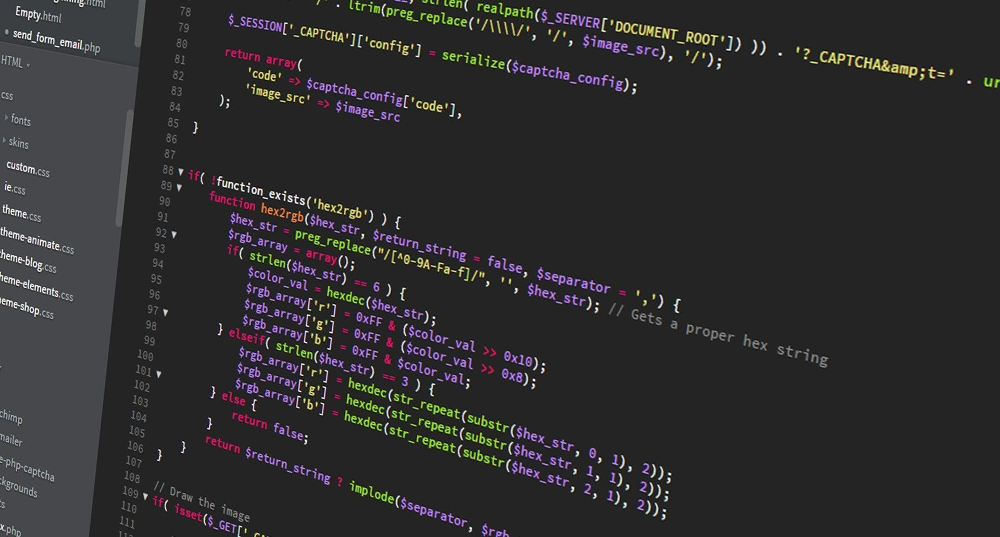

La perspectiva de la lingüística
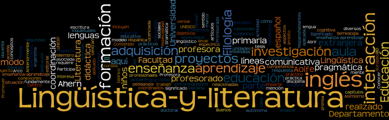

<!-- ============ 14 · TOKENS VS LEMAS ============ -->
## *Tokens* vs. lemas {data-kicker="¿Por qué el español puede ser difícil? · Dora"}

<b class="vio">Un <em>token</em>:</b> forma de cada palabra o carácter como aparecen en el texto plano.

<b class="accent">Un lema:</b>

correr
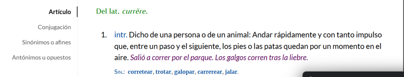

<!-- ============ 15 · AMBIGÜEDAD ============ -->
## Ambigüedad y homografía {data-kicker="¿Por qué el español puede ser difícil? · Dora"}

Banco

Gato

Sin contexto lingüístico la ambigüedad es total.

<!-- ============ 16 · STOPWORDS Y NER ============ -->
## Stopwords y entidades nombradas {data-kicker="¿Por qué el español suele ser difícil? · Dora"}

<em>Stopwords</em>

Términos de alta frecuencia como “de”, “que”, “la”, “en”, “por”, etc.

Entidades nombradas (NER)

Personas, lugares, organizaciones, fechas, cantidades.

<!-- ============ 17 · VARIACIÓN DIALECTAL ============ -->
## Variación dialectal {data-kicker="¿Por qué el español suele ser difícil? · Dora"}

<!-- ============ 18 · RUTA METODOLÓGICA ============ -->
## ¿Qué hacemos para analizar lenguaje desde la ciencia de datos? {data-kicker="Ruta metodológica · Dora" .t24}

1

Pregunta

3

Preprocesado

5

Estadística descriptiva

2

Recolección

4

Anotación

6

Validación y análisis

<!-- ============ 19 · IDEA FUERZA · DORA ============ -->
## {.dark data-state="dark" data-menu-title="Idea fuerza · Dora" background-color="#3F2F9E"}

Dora

Las decisiones críticas de PLN ocurren siempre antes del entrenamiento del modelo.

<!-- ============ 20 · DIVIDER 03 ============ -->
## {.dark data-state="dark" data-menu-title="03 · Pipeline NLP" background-color="#3F2F9E"}

::: {.z}

03

Pipeline NLP: del lenguaje a los datos

Karen

:::

<!-- ============ 21 · PIPELINE · TEXTO ============ -->
## {data-menu-title="Pipeline · Texto de entrada"}

<h4>Herramientas NLP</h4>

Tokenizar

Filtrar <em>Stopwords</em>

Lematizar

Representación vectorial

Texto de entrada

"La pandemia y la pospandemia hacen visible la necesidad del conocimiento. De su gestión dependen las estrategias de detección, atención y contención del coronavirus, el desarrollo del talento humano calificado y de los insumos tecnológicos para la prevención de la enfermedad y su tratamiento; sin duda, la calidad de los sistemas de salud se encuentra relacionada con los niveles de desarrollo científico y tecnológico de los países."

<!-- ============ 22 · PIPELINE · TOKENIZAR ============ -->
## {data-menu-title="Pipeline · Tokenizar"}

<h4>Herramientas NLP</h4>

Tokenizar

Filtrar <em>Stopwords</em>

Lematizar

Representación vectorial

Nivel palabra
[La] [pandemia] [y] [la] [pospandemia] [hacen] [visible] [la]

Nivel bigrama
[La pandemia] [pandemia y] [y la] [la pospandemia] [pospandemia hacen] [hacen visible] [visible la] [la necesidad]

Nivel subpalabra
[pos] [##pan] [##demia] [hacen] [vis] [##ible] [necesi] [##dad]

<!-- ============ 23 · PIPELINE · STOPWORDS ============ -->
## {data-menu-title="Pipeline · Filtrar stopwords"}

<h4>Herramientas NLP</h4>

Tokenizar

Filtrar <em>Stopwords</em>

Lematizar

Representación vectorial

Filtrar <em>stopwords</em>

La pandemia y la pospandemia hacen visible la necesidad del conocimiento. De su gestión dependen las estrategias de detección, atención y contención del coronavirus, el desarrollo del talento humano calificado y de los insumos tecnológicos para la prevención de la enfermedad y su tratamiento; sin duda, la calidad de los sistemas de salud se encuentra relacionada con los niveles de desarrollo científico y tecnológico de los países.

Las palabras en rojo se eliminan por ser muy frecuentes y aportar poca información.

<!-- ============ 24 · PIPELINE · LEMATIZAR ============ -->
## {data-menu-title="Pipeline · Lematizar"}

<h4>Herramientas NLP</h4>

Tokenizar

Filtrar <em>Stopwords</em>

Lematizar

Representación vectorial

Lematizar

el pandemia y el pospandemia hacer visible el necesidad de el conocimiento. de su gestión depender el estrategia de detección, atención y contención de el coronavirus, el desarrollo de el talento humano calificado y de el insumo tecnológico para el prevención de el enfermedad y su tratamiento; sin duda, la calidad de el sistema de salud se encontrar relacionado con el nivel de desarrollo científico y tecnológico de el país.

<!-- ============ 25 · PIPELINE · VECTORES ============ -->
## {data-menu-title="Pipeline · Representación vectorial"}

<h4>Herramientas NLP</h4>

Tokenizar

Filtrar <em>Stopwords</em>

Lematizar

Representación vectorial

Representación vectorial

conocimiento
<code style="font-size:22px;">[ 0.18, -0.42, 0.07, 0.55, -0.31, 0.12, ..., 0.09 ]</code>

la calidad de los sistemas de salud
<code style="font-size:22px;">[ -0.05, 0.33, 0.61, -0.14, 0.27, -0.48, ..., 0.22 ]</code>

<!-- ============ 26 · EMBEDDINGS ============ -->
## *Embeddings* {data-kicker="Karen"}

Matriz término-documento
<table class="tdm" style="margin-top:12px;width:100%;">
<tr><th style="background:transparent;"></th><th>Doc 1</th><th>Doc 2</th><th>Doc 3</th></tr>
<tr><td class="k">pandemia</td><td>2</td><td>0</td><td>1</td></tr>
<tr><td class="k">necesidad</td><td>1</td><td>1</td><td>0</td></tr>
<tr><td class="k">conocimiento</td><td>0</td><td>2</td><td>3</td></tr>
<tr><td class="k">…</td><td>…</td><td>…</td><td>…</td></tr>
<tr><td class="k">palabra n</td><td>…</td><td>…</td><td>…</td></tr>
</table>

<em>Embeddings</em> estáticos

Cada palabra tiene un solo <em>embedding</em>. Ejm: Word2Vec <code>[ 0.21, -0.35, 0.88, -0.04, ..., 0.16 ]</code>

<em>Embeddings</em> contextuales

La representación de una palabra puede variar según el contexto. Ejm: BERT

El banco aprobó el crédito para la vivienda. <code>[ 0.42, -0.11, 0.63, ..., 0.08 ]</code>

Nos sentamos en el banco del parque. <code>[ -0.19, 0.55, -0.07, ..., 0.31 ]</code>

Sentence Transformers

Codificación de fragmentos enteros. "El banco aprobó el crédito para la vivienda." <code>[ 0.27, -0.14, 0.36, ..., 0.19 ]</code>

<!-- ============ 27 · PROPIEDADES EMBEDDINGS ============ -->
## Propiedades de los *embeddings* {data-kicker="Karen"}

Cercanía semántica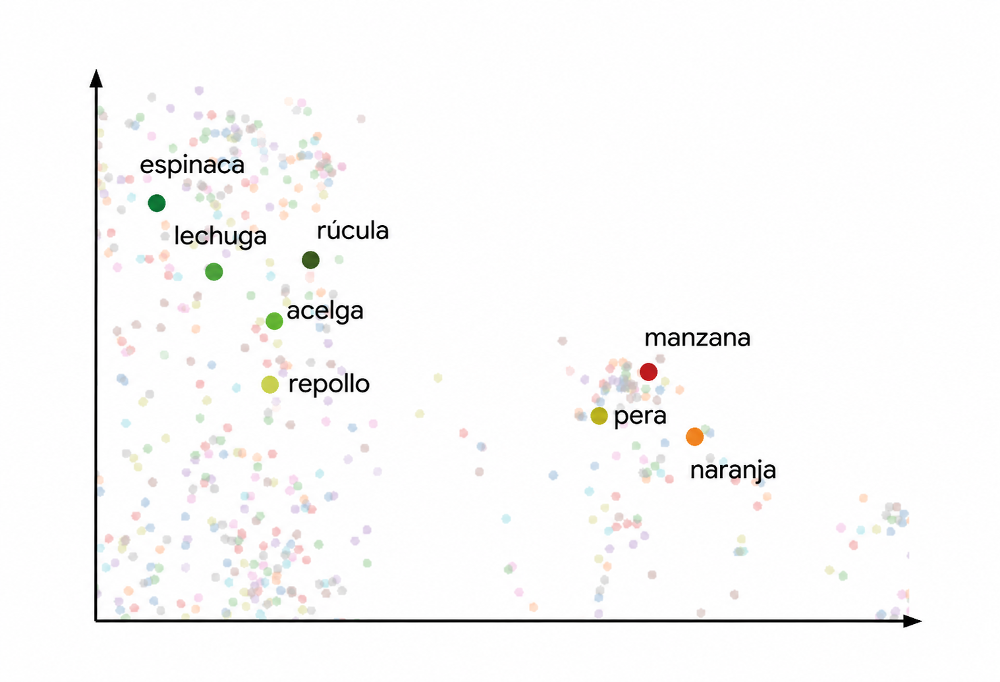

Elementos importantes

<b style="font-size:22px;">Tamaño ventana de contexto</b> ¿Cuántos tokens máximo recibe el modelo?

<b style="font-size:22px;">Tamaño del vector</b> ¿De qué tamaño queda el embedding? Ej: 1024, 2048, etc.

<b style="font-size:22px;">Idioma de entrenamiento</b> ¿En qué idioma o idiomas fue entrenado el modelo?

<b style="font-size:22px;">Tipo de tarea</b> ¿Para qué tarea fue optimizado el modelo? Ej: STS, <em>Retrieval</em>, <em>Clustering</em>.

<!-- ============ 28 · BERTOPIC ============ -->
## BERTopic {data-kicker="Aplicación de embeddings · Karen"}

"BERTopic is a topic modeling technique that leverages transformers and c-TF-IDF to create dense clusters allowing for easily interpretable topics whilst keeping important words in the topic descriptions." — (Grootendorst, 2022)

1

<b>Representación vectorial</b>
Representación vectorial de los textos con <em>embeddings</em> (tipo <em>transformers</em>).

2

<b>Reducción de dimensión</b>
Ejm: 1024 a 5 componentes por vector. Algoritmo: UMAP.

3

<b><em>Clustering</em></b>
Agrupar los textos por distancia. Algoritmo: HDBSCAN.

4

<b>Representación de tópicos</b>
Selección de palabras para representar el tópico, comunes que diferencian entre grupos. Algoritmo: c-TF-IDF.

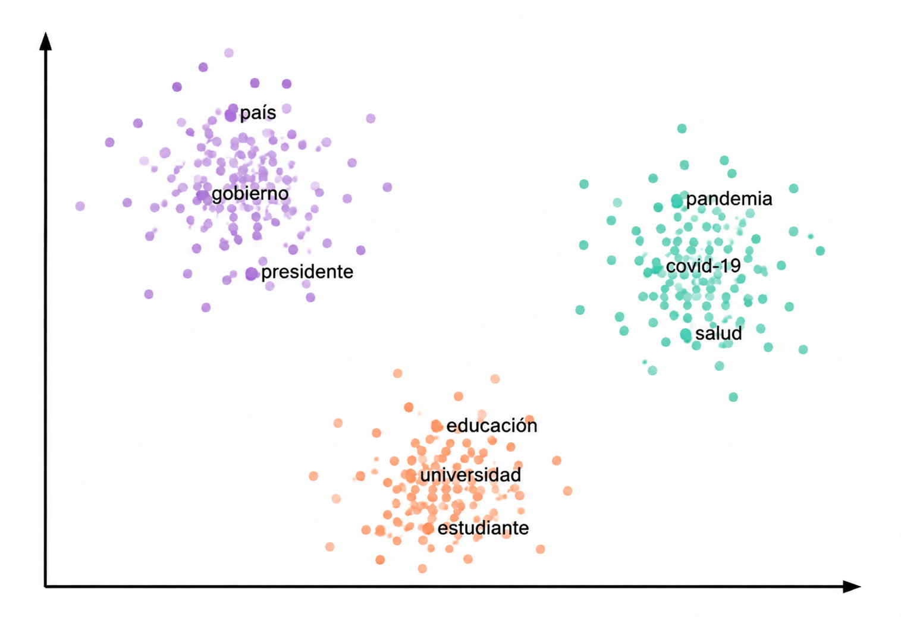

<!-- ============ 29 · LLMs ============ -->
## LLMs · *Large Language Models* {data-kicker="Karen"}

¿Qué es un modelo del lenguaje?

Un sistema que, dado un contexto de palabras previas, asigna una distribución de probabilidad sobre la siguiente palabra.

<code style="font-size:19.5px;">"El agua del lago Walden es tan hermosamente ___"</code>

<b class="vio">Probable:</b> azul, verde, transparente &nbsp;&nbsp; <b class="vio">Improbable:</b> refrigerador, esto

¿Qué pueden hacer los LLMs?

Resumir, traducir, responder preguntas, generar código, analizar argumentos.

<em>Prompting</em> · uso de un LLM

Un <em>prompt</em> es el texto que el usuario entrega al modelo para obtener una respuesta útil. El modelo genera tokens de forma iterativa condicionado en ese texto.

<code>"P: ¿Quién escribió El origen de las especies? R:"</code> → "Charles Darwin"

Control de aleatoriedad

<b>Temperatura:</b> reescala las probabilidades (baja = más probable; alta = más diversidad). <b><em>Top-k</em>:</b> conserva las k más probables. <b><em>Top-p</em>:</b> conjunto mínimo cuya probabilidad acumulada supera p.

<b>Alucinación:</b> el modelo puede sonar coherente y seguro, pero no corresponder con los hechos reales.

<!-- ============ 29b · RAG · RESUMEN GRÁFICO (Karen 10) ============ -->
## RAG · *Retrieval Augmented Generation* {data-kicker="Karen"}

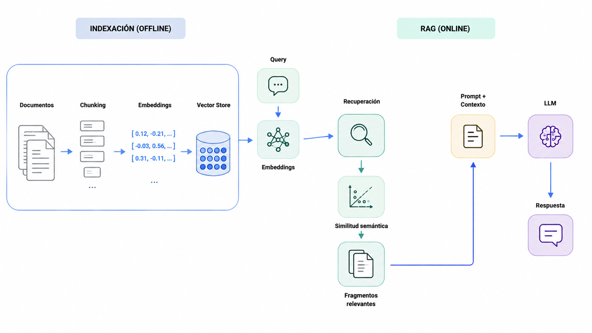

Imagen generada con ChatGPT

<!-- ============ 30 · RAG ============ -->
## RAG · *Retrieval Augmented Generation* {data-kicker="Karen" .t28}

1

<b style="font-size:21px;">Preparar corpus o documentos</b>

<b class="vio"><em>Chunking</em> o fragmentación:</b> división del corpus en fragmentos de tamaño manejable; cada fragmento se convierte en un <em>embedding</em>.

2

<b style="font-size:21px;">Representación vectorial: <em>embeddings</em></b>

3

<b style="font-size:21px;"><em>Vector Store</em>:</b> índice para recuperar fragmentos rápidamente. Ejm: FAISS.

4

<b style="font-size:21px;">Recuperación de fragmentos relevantes</b> dado un <em>query</em> o pregunta.

<b class="vio">Similitud semántica:</b> la pregunta del usuario se convierte en <em>embedding</em>; se recuperan los fragmentos más cercanos.

5

<b style="font-size:21px;">LLM</b>

<b class="vio">Generación aumentada:</b> el LLM recibe la pregunta junto con los fragmentos recuperados y genera una respuesta fundamentada en ellos.

<b class="vio"><em>Prompt</em> LLM:</b> instrucciones para el modelo; incluyen la pregunta y los fragmentos recuperados, indicando que responda con base en ese contexto.

<!-- ============ 30b · RECUPERACIÓN SEMÁNTICA (Karen 12) ============ -->
## Recuperación semántica de información para análisis de texto {data-kicker="Karen" .t26}

Recolección de datos

→

Preprocesamiento

Tokenización

Eliminación de <em>stopwords</em>

Lematización

→

Identificación de referencias a la ciencia

Representación con <em>embeddings</em>

Matriz de similitud

Selección de umbral

→

Corpus y subcorpus de ciencia

→

Análisis comparativo

Descriptivo y exploratorio

Reconocimiento de entidades

Modelado de tópicos

Vocabulario · <em>POS-tagging</em>

→

Interpretación y discusión

La parte de recuperación de la arquitectura RAG inspiró una metodología para identificar <b>menciones a las ciencias naturales</b> de manera no literal en columnas de opinión.

documentos

→

13 mil columnas de opinión convertidas en 62 mil fragmentos

<em>query</em>

→

Palabras para representar a las ciencias naturales: Tesauro de la UNESCO — Ciencia

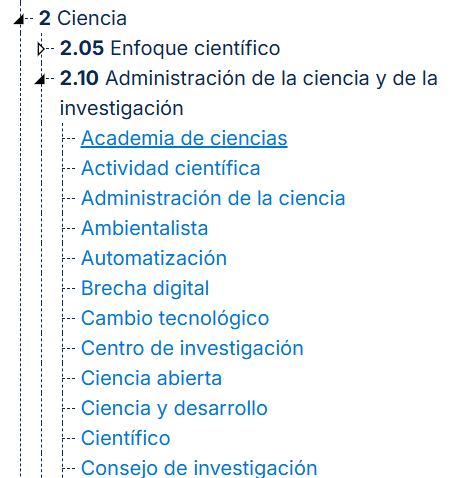
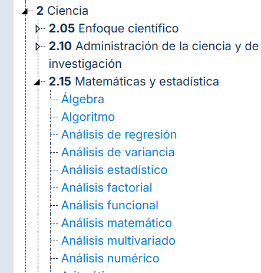

<!-- ============ 31 · DIVIDER 04 ============ -->
## {.dark data-state="dark" data-menu-title="04 · Caso de uso en salud" background-color="#3F2F9E"}

::: {.z}

04

Caso de uso: tweets y aplicación en salud

Andrés

:::

<!-- ============ 32 · MISMA METODOLOGÍA ============ -->
## La misma metodología, otro dominio {data-kicker="Contexto y metodología · Andrés"}

Objetivo
<ul class="golddot" style="margin-top:8px;">
<li>Caracterizar cómo se habla de salud en un corpus de tuits en español.</li>
<li>Identificar actores, instituciones, enfermedades y medicamentos frecuentes.</li>
<li>Describir la evolución temporal y temática del subcorpus.</li>
</ul>

Pipeline aplicado

1

Selección del subcorpus de salud (similitud semántica).

2

Descriptivos: autores, tipo de cuenta, evolución mensual.

3

13 subcategorías temáticas de salud.

4

NER, POS (Stanza) y BERTopic.

5

Búsqueda dirigida: lugares, instituciones, enfermedades, medicamentos.

<!-- ============ 33 · DESCRIPTIVOS · AUTORES ============ -->
## Distribución de autores {data-kicker="Salud · Andrés · Resultados"}

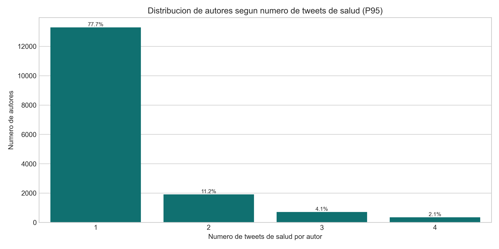

Distribución de autores según nº de tuits sobre salud

<!-- ============ 33b · DESCRIPTIVOS · EVOLUCIÓN ============ -->
## Evolución mensual {data-kicker="Salud · Andrés · Resultados"}

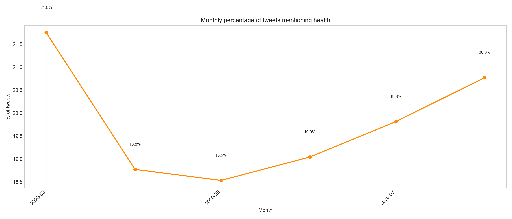

Porcentaje mensual de tuits que mencionan salud

<!-- ============ 34 · QUIÉN HABLA ============ -->
## Quién habla de salud {data-kicker="Salud · Andrés · Resultados"}

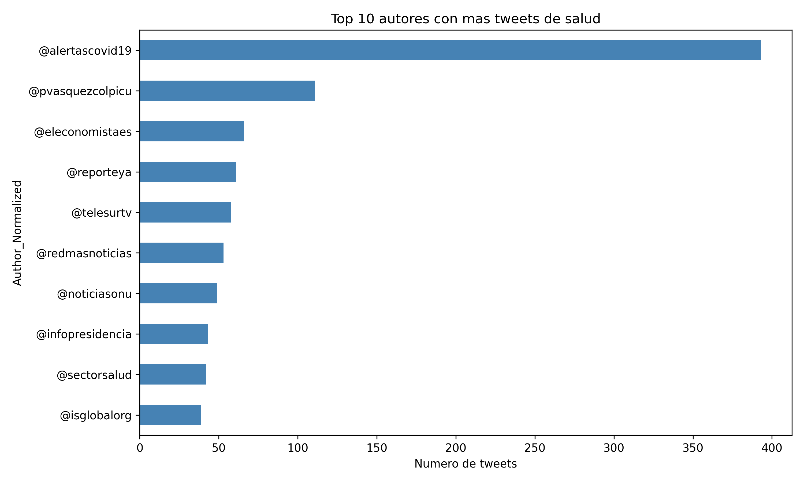

Top autores con más tuits de salud

<!-- ============ 34b · INSTITUCIONES ============ -->
## Instituciones más mencionadas {data-kicker="Salud · Andrés · Resultados"}

Instituciones de salud más mencionadas

<!-- ============ 35 · PALABRAS Y POS ============ -->
## Palabras y categorías gramaticales {data-kicker="Salud · Andrés · Resultados"}

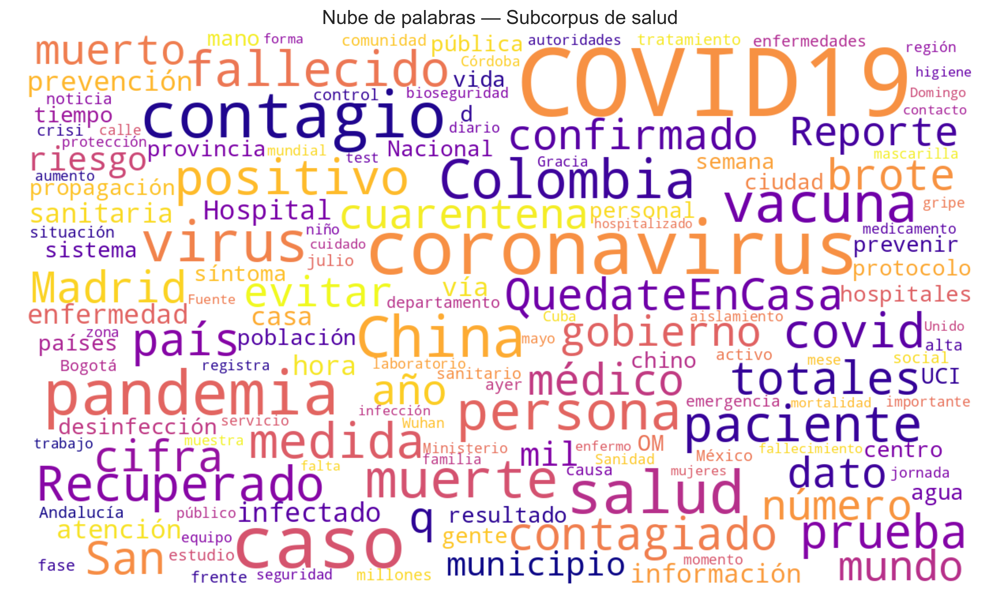

Nube de palabras (lematizadas, sin stopwords)

<!-- ============ 36 · ENFERMEDADES (con y sin COVID) ============ -->
## Enfermedades más mencionadas {data-kicker="Salud · Andrés · Resultados"}

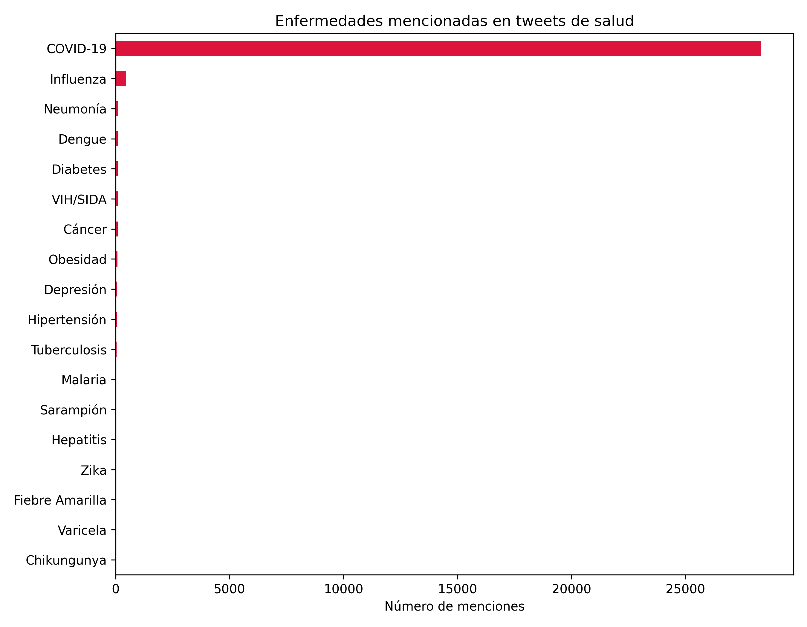
Con COVID-19 — domina el conteo

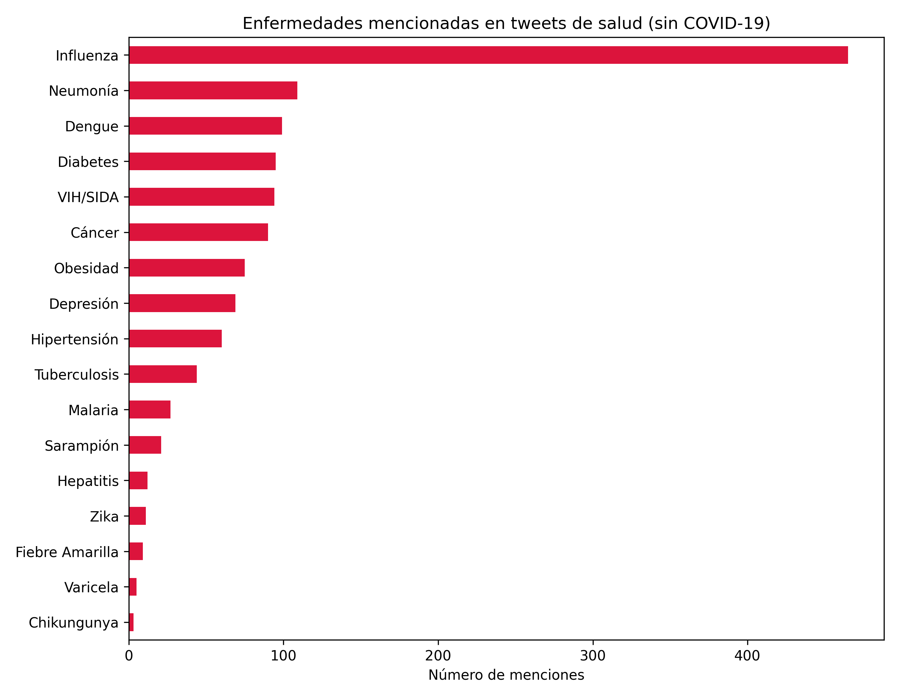
Sin COVID-19 — se ven las demás

<!-- ============ 36b · MEDICAMENTOS ============ -->
## Medicamentos más mencionados {data-kicker="Salud · Andrés · Resultados"}

Medicamentos más mencionados

<!-- ============ 37 · GRAFO 2020 ============ -->
## Entidades asociadas a "salud" en 2020 {data-kicker="Salud · Andrés · El año de la pandemia"}

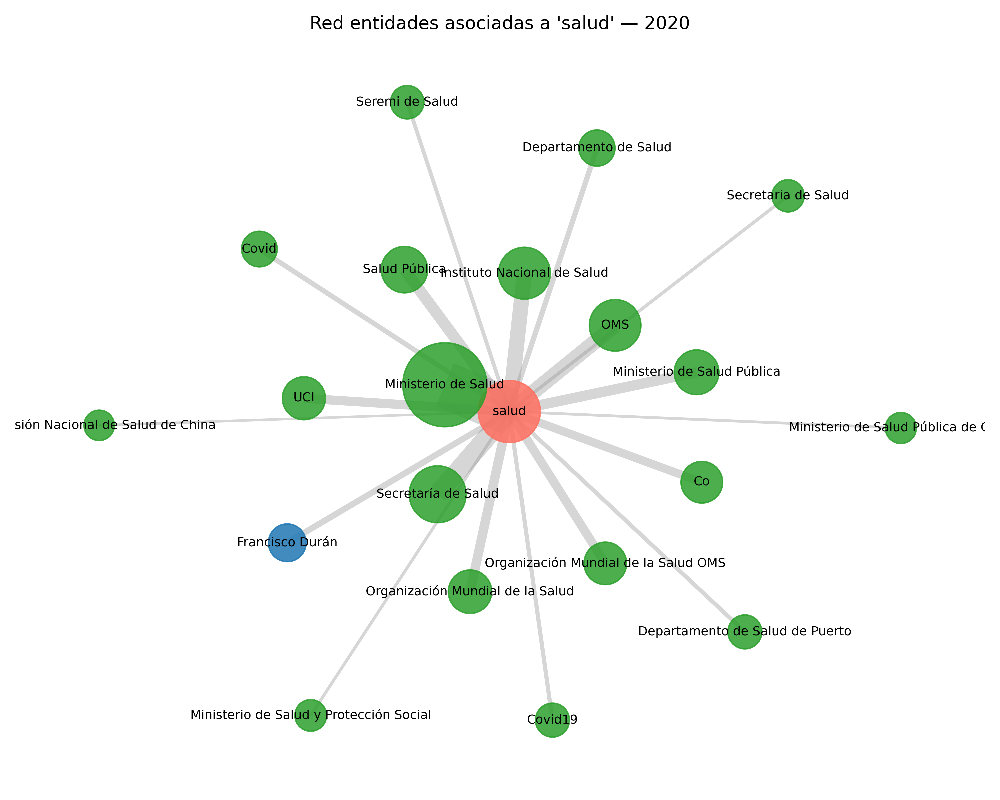

<h3>Cómo leer el grafo</h3>
<ul class="golddot">
<li>Nodo central: la palabra "salud".</li>
<li>Nodos azules: personas (PER).</li>
<li>Nodos verdes: organizaciones (ORG).</li>
<li>Tamaño y grosor = frecuencia de co-ocurrencia.</li>
</ul>

<!-- ============ 38 · HALLAZGOS ============ -->
## Hallazgos del caso {data-kicker="Salud · Andrés"}

🎯Concentración
La conversación sobre salud se concentra en pocos autores e instituciones.

📈Estacionalidad
La actividad varía en el tiempo, con picos ligados a coyunturas de salud pública.

🧬Diversidad temática
Cubre muchas subcategorías, enfermedades y medicamentos específicos.

Próximos pasos
Profundizar tópicos (BERTopic) por subcategoría · comparar salud con comportamientos protectores · explorar la relación entre cobertura mediática y comportamiento.

<!-- ============ 39 · DIVIDER 05 ============ -->
## {.dark data-state="dark" data-menu-title="05 · Práctica guiada" background-color="#3F2F9E"}

::: {.z}

05

Práctica guiada en Python

Equipo

:::

<!-- ============ 40 · MANOS A LA OBRA ============ -->
## Manos a la obra: todo listo en Google Colab {data-kicker="Práctica · Equipo" .t28}

<!-- ============ 41 · PARA LLEVAR (lista) ============ -->
## Para llevar {data-kicker="Cierre · Equipo"}

<ul class="golddot">
<li style="font-size:28px;margin:.55em 0;">El texto puede convertirse en datos, pero sin decisiones.</li>
<li style="font-size:28px;margin:.55em 0;">La lingüística ayuda a evitar interpretaciones pobres o erradas.</li>
<li style="font-size:28px;margin:.55em 0;">Python permite escalar preguntas humanísticas y sociales.</li>
<li style="font-size:28px;margin:.55em 0;">Una metodología de NLP puede adaptarse a columnas, <em>tweets</em> y salud.</li>
<li style="font-size:28px;margin:.55em 0;">La interdisciplinariedad no es un adorno: es parte del método.</li>
</ul>

<!-- ============ 42 · CIERRE ============ -->
## {.dark data-state="dark" data-menu-title="Cierre y conversación final" background-color="#3F2F9E"}

Cierre y conversación final · Biviana

El lenguaje no es solo una columna de <em>strings</em>.

También es cómo una sociedad argumenta, nombra problemas y construye sentido. Gracias por acompañarnos.

¡Gracias!

BivianaDoraKarenAndrés

Califica el taller

Escanea y déjanos tu <em>feedback</em>: nos ayuda a mejorar PyCon Colombia.

