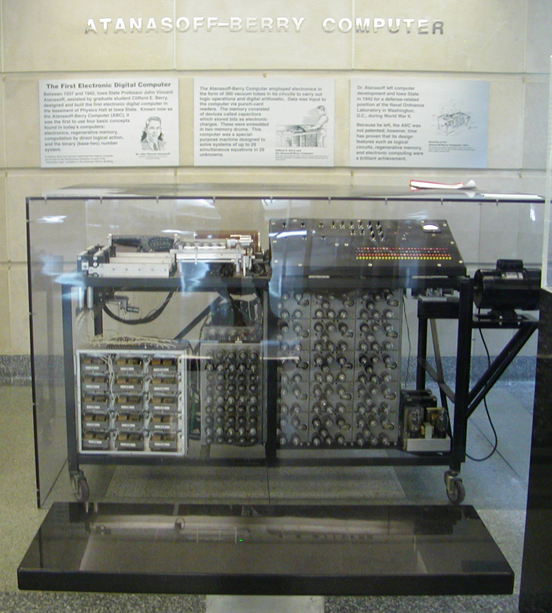
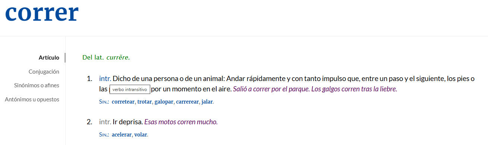
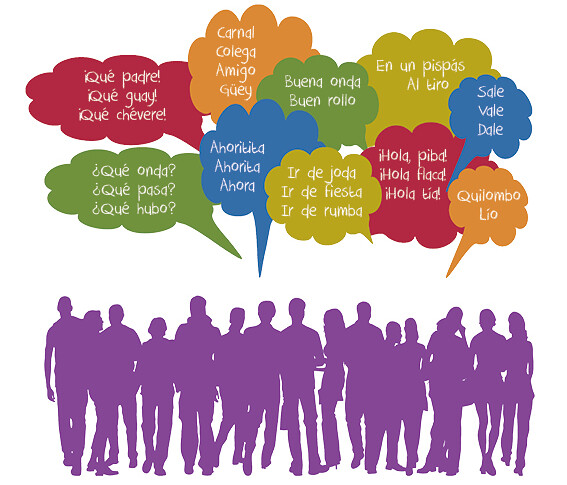
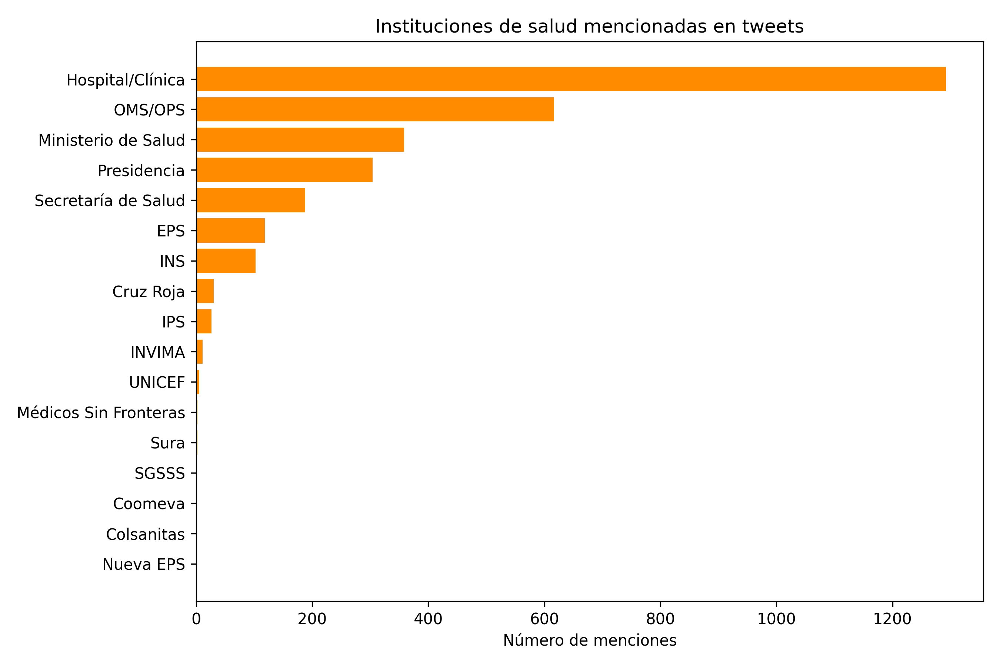
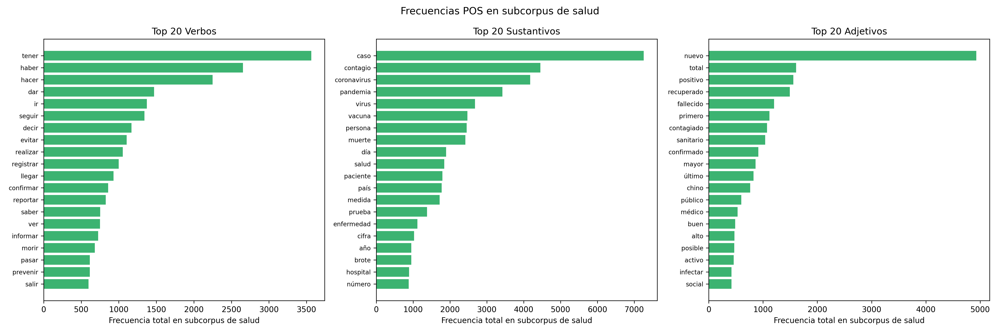
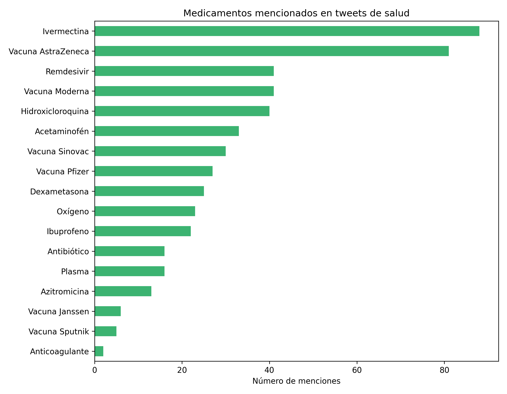

## Ruta del taller {.smaller}

[Agenda · 120 minutos]{.kicker}

| # | Bloque | Presenta | Tiempo |
|---|--------|----------|:------:|
| **01** | Rompehielos e introducción | Biviana | 15 min |
| **02** | ¿Qué saber sobre el lenguaje? | Dora | 15 min |
| **03** | Del lenguaje a los datos | Karen | 25 min |
| **04** | Caso 1 · Columnas de opinión | Karen | 20 min |
| **05** | Caso 2 · Salud en Twitter | Andrés | 20 min |
| **06** | Práctica guiada en Colab | Todos | 25 min |

::: {.notes}
Orden acordado: Biviana → Dora → Karen → Caso 1 (Karen) → Caso 2 (Andrés) → Práctica.
:::

## {.divider data-menu-title="01 · Rompehielos" background-color="#3A2FB8"}

[01]{.divnum}

### Rompehielos e introducción

[Biviana]{.pill} &nbsp; 15 min


## Tres textos, una pregunta

[Enganche · Biviana]{.kicker}

:::: {.columns}
::: {.column width="33%"}
::: {.card}
### 📱 Un tuit político
*"El gobierno anuncia otra reforma… y el país entero opina en 280 caracteres."*
:::
:::
::: {.column width="33%"}
::: {.card}
### 📰 Un titular de prensa
*"Ministerio de Salud reporta un nuevo pico de contagios en la región."*
:::
:::
::: {.column width="33%"}
::: {.card}
### ✍️ Una columna de opinión
*"La ciencia dejó de ser un tema de laboratorio para volverse conversación pública."*
:::
:::
::::

::: {.card-deep style="margin-top:.5em"}
**¿Qué pueden aprender sobre una sociedad a partir de millones de textos como estos?**
<br><span class="gold">Recojan respuestas del público antes de avanzar.</span>
:::

::: {.notes}
Proyectar los tres textos y recoger respuestas del público en voz alta.
:::


## Dos preguntas para el público

[Enganche · Biviana]{.kicker}

:::: {.columns}
::: {.column width="50%"}
::: {.card}
📦 &nbsp; **Si les entregara 100.000 textos, [¿cómo los analizarían?]{style="color:#6155F5"}**

[Nadie los leería a mano. Necesitamos un método… y una herramienta.]{.muted}
:::
:::
::: {.column width="50%"}
::: {.card}
🧠 &nbsp; **¿Qué es más difícil para un computador: sumar millones de números o [entender una sola frase?]{.accent}**

[La aritmética es trivial; el lenguaje, no.]{.muted}
:::
:::
::::

::: {.card-violet style="margin-top:.5em"}
**El lenguaje humano contiene información valiosísima, pero está en forma no estructurada.**
<br>Hoy veremos cómo convertir ese texto en datos utilizando Python.
:::

::: {.notes}
Contraste: sumar es fácil, entender lenguaje es lo difícil. De ahí sale el objetivo del taller.
:::


## El origen del NLP: no nació del amor a la lingüística {.smaller}

[Contexto histórico · Biviana]{.kicker}

:::: {.columns}
::: {.column width="60%"}
- **1940s** — Primeras computadoras: Z3, Colossus, ENIAC (1946).
- **1949** — El padre Roberto Busa procesa el *Index Thomisticus*: las máquinas pueden analizar grandes cantidades de texto.
- **1950s** — Guerra Fría: EE. UU. busca traducir del ruso al inglés. Necesidad estratégica, no lingüística.
- **1950–65** — Chomsky y las gramáticas formales impulsan modelos capaces de analizar y generar lenguaje.
:::
::: {.column width="40%"}
{width="82%" fig-align="center"}

[Las primeras máquinas de cómputo (años 40).]{.muted style="text-align:center"}
:::
::::

::: {.notes}
El NLP surge de una necesidad tecnológica y estratégica, no de la lingüística.
:::


## De ELIZA al big data {.smaller}

[Evolución · Biviana]{.kicker}

:::: {.columns}
::: {.column width="38%"}
{width="95%" fig-align="center"}

[ELIZA (1966): simulaba conversación con reglas predefinidas.]{.muted style="text-align:center"}
:::
::: {.column width="62%"}
- **1966** — ELIZA y los primeros sistemas conversacionales basados en reglas.
- **1980s** — Las teorías lingüísticas se integran; llegan los computadores personales.
- **1990s** — La World Wide Web: dejamos los ejemplos de laboratorio por lenguaje real de millones de personas.
- **2000s** — [Big data + deep learning:]{style="color:#6155F5;font-weight:700"} ya no programamos reglas, aprendemos patrones de miles de millones de palabras.
:::
::::

::: {.notes}
Punto de inflexión: los 90 con la web y luego los 2000 con big data y deep learning.
:::

## {.divider data-menu-title="02 · Lenguaje" background-color="#3A2FB8"}

[02]{.divnum}

### ¿Qué necesita saber sobre el lenguaje?

[Dora]{.pill} &nbsp; 15 min


## ¿Qué es una palabra?

[Actividad participativa · Dora]{.kicker}

::: {style="text-align:center;margin:.3em 0"}
[Banco]{.tok style="font-size:1.4em"} &nbsp; [Gato]{.tok style="font-size:1.4em"} &nbsp; [Correr]{.tok-pink .tok style="font-size:1.4em"} &nbsp; [Corrí]{.tok-pink .tok style="font-size:1.4em"} &nbsp; [Corriendo]{.tok-pink .tok style="font-size:1.4em"}
:::

::: {.card}
**Si contaran frecuencias en texto plano, ¿cuántas palabras diferentes ven aquí?**

[Para un algoritmo básico:]{style="color:#6155F5;font-weight:700"} cinco cadenas de caracteres distintas.

[Pero "correr", "corrí" y "corriendo"]{.accent} son realizaciones de una misma unidad léxica. Aquí el español empieza a ponerse difícil.
:::

::: {.notes}
La respuesta común es cinco. Para un lingüista, no. Puente hacia tokens vs lemas.
:::


## Tokens vs. lemas

[Por qué el español es difícil · Dora]{.kicker}

:::: {.columns}
::: {.column width="50%"}
[**Token**]{style="color:#6155F5"} · forma de la palabra tal como aparece en el texto.

[**Lema**]{.accent} · unidad léxica de referencia (forma de diccionario).

::: {style="margin-top:.4em"}
[correr]{.tok} [corrí]{.tok} [corriendo]{.tok} &nbsp;→&nbsp; [correr]{.tok-pink .tok}
:::

[Sin lematización, el modelo trata "corrí" y "correr" como conceptos independientes y pierde potencia estadística.]{.muted}
:::
::: {.column width="50%"}
{width="100%" fig-align="center"}

[El español tiene morfología rica: un verbo puede tener decenas de formas.]{.muted style="text-align:center"}
:::
::::

::: {.notes}
Muchas formas, un solo lema. La lematización agrupa esas formas.
:::


## Ambigüedad y homografía

[El problema de "banco" · Dora]{.kicker}

::: {.card}
[**Banco**]{style="color:#6155F5;font-size:1.2em"} &nbsp; 🏦 entidad financiera &nbsp;·&nbsp; 🪑 asiento para sentarse
:::
::: {.card style="margin-top:.35em"}
[**Sobre**]{style="color:#6155F5;font-size:1.2em"} &nbsp; ✉️ objeto para guardar cartas &nbsp;·&nbsp; ➡️ preposición ("sobre la mesa")
:::
::: {.card style="margin-top:.35em"}
[**Gato**]{style="color:#6155F5;font-size:1.2em"} &nbsp; 🐱 animal doméstico &nbsp;·&nbsp; 🔧 herramienta para levantar el auto
:::

::: {style="text-align:center;margin-top:.5em;color:#3A2FB8;font-style:italic"}
Sin contexto lingüístico, la ambigüedad es total. Determinar la función según las palabras vecinas es una tarea fundamental.
:::

::: {.notes}
Homografía: misma forma, distinto significado. El contexto desambigua.
:::


## Stopwords y entidades nombradas

[Dos decisiones clave · Dora]{.kicker}

:::: {.columns}
::: {.column width="50%"}
::: {.card}
### 🧹 Stopwords
[de]{.tok} [el]{.tok} [la]{.tok} [que]{.tok}

Palabras muy frecuentes que suelen aportar poca información semántica y solemos eliminar.

[**Cuidado:**]{.accent} en español pueden marcar relaciones, estructura sintáctica o matices de significado.
:::
:::
::: {.column width="50%"}
::: {.card}
### 🏷️ Entidades nombradas
No todas las palabras deben tratarse igual.

[Personas]{.tok} [Lugares]{.tok} [Instituciones]{.tok} [Organizaciones]{.tok}

[Reconocer nombres propios preserva el significado del texto (NER).]{.muted}
:::
:::
::::

::: {.notes}
Stopwords: eliminar con cuidado. NER: reconocer entidades para no perder significado.
:::


## Variación dialectal: ¿de qué país es tu dato?

[El español no es uno solo · Dora]{.kicker}

:::: {.columns}
::: {.column width="52%"}
{width="88%" fig-align="center"}
:::
::: {.column width="48%"}
### No existe un único español
Un modelo entrenado solo con datos de España tendrá dificultades con formas de Argentina, México o Colombia.

::: {.card-violet style="margin-top:.4em"}
**En redes sociales** la variación dialectal se vuelve una fuente importante de ruido si no la tenemos en cuenta desde el inicio.
:::
:::
::::

::: {.notes}
El data scientist no necesita ser lingüista, pero sí entender esto.
:::

## {.divider data-menu-title="03 · Del lenguaje a los datos" background-color="#3A2FB8"}

[03]{.divnum}

### Del lenguaje a los datos

[Karen]{.pill} &nbsp; 25 min


## La ruta metodológica {.smaller}

[Antes de abrir Python · Karen]{.kicker}

:::: {.columns}
::: {.column width="33%"}
::: {.card}
### a · Pregunta
Definir qué queremos responder.
:::
:::
::: {.column width="33%"}
::: {.card}
### b · Corpus
¿Es representativo? Prensa, tuits, historias clínicas…
:::
:::
::: {.column width="33%"}
::: {.card}
### c · Preprocesado
Limpiar HTML, emojis, ruido; minúsculas y tokenizar.
:::
:::
::::
:::: {.columns style="margin-top:.35em"}
::: {.column width="33%"}
::: {.card}
### d · Anotación
Lematizar y etiquetar POS (FreeLing, Stanza).
:::
:::
::: {.column width="33%"}
::: {.card}
### e · Vectorización
Palabras como vectores (Word2Vec, BERT).
:::
:::
::: {.column width="33%"}
::: {.card}
### f · Validación
Revisión humana: ¿el modelo interpreta bien?
:::
:::
::::

::: {.notes}
Siempre empieza con una pregunta y termina con validación humana.
:::


## El pipeline, paso a paso — 1 · Texto {.smaller}

[Del texto a los datos · Karen]{.kicker}

[**1 Texto**]{.tok-pink .tok} [2 Tokenizar]{.tok} [3 Stopwords]{.tok} [4 Lematizar]{.tok} [5 Matriz]{.tok} [6 Visualizar]{.tok}

::: {.card style="margin-top:.5em"}
### Texto original
*"La pandemia y la pospandemia hacen visible la necesidad del conocimiento. De su gestión dependen las estrategias de detección, atención y contención del coronavirus, el desarrollo del talento humano calificado y de los insumos tecnológicos para la prevención de la enfermedad y su tratamiento."*
:::

::: {.notes}
Partimos de texto plano, no estructurado.
:::


## El pipeline, paso a paso — 2 · Tokenizar {.smaller}

[1 Texto]{.tok} [**2 Tokenizar**]{.tok-pink .tok} [3 Stopwords]{.tok} [4 Lematizar]{.tok} [5 Matriz]{.tok} [6 Visualizar]{.tok}

::: {.card-violet style="margin-top:.5em"}
**Nivel palabra** — `[La] [pandemia] [y] [la] [pospandemia] [hacen] [visible] [la] …`
:::
::: {.card style="margin-top:.3em"}
**Nivel bigrama** — `[La pandemia] [pandemia y] [y la] [la pospandemia] [pospandemia hacen] …`
:::
::: {.card style="margin-top:.3em"}
**Nivel subpalabra** — `[pos] [##pan] [##demia] [hacen] [vis] [##ible] [necesi] [##dad] …`
:::

::: {.notes}
Tokenizar: dividir el texto. Palabra, bigrama o subpalabra.
:::


## El pipeline, paso a paso — 3 · Stopwords {.smaller}

[1 Texto]{.tok} [2 Tokenizar]{.tok} [**3 Stopwords**]{.tok-pink .tok} [4 Lematizar]{.tok} [5 Matriz]{.tok} [6 Visualizar]{.tok}

::: {.card style="margin-top:.5em"}
### Stopwords eliminadas
`pandemia  pospandemia  visible  necesidad  conocimiento  gestión  dependen  estrategias  detección  atención  contención  coronavirus  desarrollo  talento  humano  calificado  insumos  tecnológicos  prevención  enfermedad  tratamiento`

[Quitamos "la, y, del, de, su, las, el…". Queda el contenido con carga semántica — pero en español conviene revisar qué se elimina.]{.muted}
:::

::: {.notes}
Eliminamos palabras vacías para quedarnos con lo informativo.
:::


## El pipeline, paso a paso — 4 · Lematizar {.smaller}

[1 Texto]{.tok} [2 Tokenizar]{.tok} [3 Stopwords]{.tok} [**4 Lematizar**]{.tok-pink .tok} [5 Matriz]{.tok} [6 Visualizar]{.tok}

::: {.card style="margin-top:.5em"}
### Lematización
`el pandemia y el pospandemia hacer visible el necesidad de el conocimiento. de su gestión depender el estrategia de detección, atención y contención de el coronavirus, el desarrollo de el talento humano calificado y de el insumo tecnológico…`

[Cada forma se lleva a su lema: "hacen"→hacer, "estrategias"→estrategia, "insumos"→insumo.]{.muted}
:::

::: {.notes}
Lematizar agrupa las formas en su unidad léxica.
:::


## El pipeline, paso a paso — 5 · Matriz {.smaller}

[1 Texto]{.tok} [2 Tokenizar]{.tok} [3 Stopwords]{.tok} [4 Lematizar]{.tok} [**5 Matriz**]{.tok-pink .tok} [6 Visualizar]{.tok}

::: {.card style="margin-top:.5em"}
### Representación vectorial (matriz documento-término)

[conocimiento]{.tok} → `[ 0.18, −0.42, 0.07, 0.55, −0.31, 0.12, …, 0.09 ]`

[la calidad de los sistemas de salud]{.tok} → `[ −0.05, 0.33, 0.61, −0.14, 0.27, −0.48, …, 0.22 ]`

[Cada texto pasa a ser un vector de números: ya podemos calcular, comparar y agrupar.]{.muted}
:::

::: {.notes}
El texto se vuelve vectores: el puente hacia el modelado.
:::


## El pipeline, paso a paso — 6 · Visualizar {.smaller}

[1 Texto]{.tok} [2 Tokenizar]{.tok} [3 Stopwords]{.tok} [4 Lematizar]{.tok} [5 Matriz]{.tok} [**6 Visualizar**]{.tok-pink .tok}

:::: {.columns style="margin-top:.4em"}
::: {.column width="50%"}
{width="100%" fig-align="center"}
:::
::: {.column width="50%"}
::: {.card-violet}
### Visualización
Frecuencias, nubes de palabras, mapas semánticos, evolución temporal… El resultado se vuelve legible para humanos.

[Palabras con significado parecido caen cerca en el espacio vectorial.]{style="color:#D3D4F6;font-style:italic;font-size:.85em"}
:::
:::
::::

::: {.notes}
Cerramos el pipeline haciendo legible el resultado.
:::


## Todo esto: ~20 líneas de Python {.smaller data-background-color="#3A2FB8"}

[Karen]{.pill}

```python
import spacy, collections
from sklearn.feature_extraction.text import CountVectorizer
from wordcloud import WordCloud

nlp = spacy.load("es_core_news_sm")
docs = [nlp(t.lower()) for t in corpus]

tokens = [tok.lemma_ for d in docs for tok in d
          if not tok.is_stop and tok.is_alpha]

frecuencias = collections.Counter(tokens)
X = CountVectorizer().fit_transform(corpus)   # matriz doc-término
WordCloud().generate(" ".join(tokens)).to_file("nube.png")
```

::: {style="color:#D3D4F6;text-align:center;font-style:italic;font-size:.8em"}
La audiencia de PyCon disfruta más entender el flujo que ver código durante 20 minutos.
:::

::: {.notes}
Solo aquí mostramos código, y muy poco. El foco fue el flujo.
:::


## Embeddings: de la matriz a los vectores densos {.smaller}

[Representación vectorial · Karen]{.kicker}

:::: {.columns}
::: {.column width="50%"}
::: {.card}
### Embeddings estáticos
Cada palabra tiene un solo vector. Ej.: Word2Vec, FastText.

`banco → [ 0.21, −0.35, 0.88, −0.04, … ]`

[Un único "banco" para todos los sentidos.]{.muted}
:::
:::
::: {.column width="50%"}
::: {.card-violet}
### Embeddings contextuales
La representación cambia según el contexto. Ej.: BERT.

`"El banco aprobó el crédito." → [ 0.42, −0.11, 0.63, … ]`
`"Me senté en el banco." → [ −0.20, 0.55, 0.09, … ]`
:::
:::
::::

::: {.card style="margin-top:.35em"}
**Al elegir un modelo importan:** ventana de contexto · tamaño del vector (1024, 2048…) · idioma de entrenamiento · tarea para la que fue optimizado.
:::

::: {.notes}
BERT resuelve la ambigüedad que veíamos con "banco".
:::


## BERTopic: descubrir temas automáticamente {.smaller}

[Aplicación de embeddings · Karen]{.kicker}

:::: {.columns}
::: {.column width="52%"}
{width="100%" fig-align="center"}

[Los textos se agrupan por cercanía semántica en tópicos interpretables.]{.muted style="text-align:center"}
:::
::: {.column width="48%"}
1. **Representación vectorial** — embeddings tipo transformers.
2. **Reducción de dimensión** — de 1024 a ~5 componentes (UMAP).
3. **Clustering** — agrupar por distancia (HDBSCAN).
4. **Representación de tópicos** — palabras clave por grupo (c-TF-IDF).
:::
::::

::: {.notes}
BERTopic combina transformers + c-TF-IDF para tópicos interpretables.
:::


## LLMs: modelos del lenguaje {.smaller}

[Del conteo a la generación · Karen]{.kicker}

:::: {.columns}
::: {.column width="50%"}
::: {.card}
### ¿Qué es un modelo del lenguaje?
Dado un contexto de palabras previas, asigna una probabilidad a la siguiente palabra.

*"El agua del lago Walden es tan hermosamente ___"*

[Probable:]{style="color:#6155F5;font-weight:700"} azul, verde, transparente · [Improbable:]{.accent} refrigerador
:::
:::
::: {.column width="50%"}
::: {.card}
### Prompting: usar un LLM
Un prompt es el texto que entregamos al modelo. Genera tokens de forma iterativa condicionado en él.

`P: ¿Quién escribió El origen de las especies? R:` → *"Charles Darwin"*

[La temperatura regula qué tan "creativa" es la respuesta.]{.muted}
:::
:::
::::

::: {.notes}
Un LLM predice la siguiente palabra; el prompt condiciona esa generación.
:::


## RAG: recuperar antes de responder {.smaller}

[Retrieval Augmented Generation · Karen]{.kicker}

[**1 Corpus**]{.tok} → [**2 Embeddings**]{.tok} → [**3 Vector Store (FAISS)**]{.tok} → [**4 Recuperación**]{.tok} → [**5 LLM**]{.tok-pink .tok}

:::: {.columns style="margin-top:.5em"}
::: {.column width="33%"}
::: {.card}
### Chunking
Dividir el corpus en fragmentos manejables; cada uno se vuelve un embedding.
:::
:::
::: {.column width="33%"}
::: {.card}
### Similitud semántica
La pregunta se convierte en embedding; se recuperan los fragmentos más cercanos.
:::
:::
::: {.column width="33%"}
::: {.card}
### Prompt al LLM
Instrucciones + fragmentos recuperados como contexto para responder.
:::
:::
::::

::: {.notes}
RAG conecta un LLM con nuestro propio corpus vía recuperación semántica.
:::

## {.divider data-menu-title="04 · Caso 1" background-color="#3A2FB8"}

[04]{.divnum}

### Caso 1 · Columnas de opinión

[Karen]{.pill} &nbsp; 20 min


## La ciencia en la esfera pública

[El proyecto · Karen]{.kicker}

:::: {.columns}
::: {.column width="48%"}
::: {.card-violet}
### El corpus
[+13.000]{.stat}
<br>columnas de opinión

[El Tiempo]{.tok} [El Espectador]{.tok} [Semana]{.tok}

[Un volumen imposible de leer manualmente.]{style="color:#D3D4F6;font-style:italic;font-size:.85em"}
:::
:::
::: {.column width="52%"}
### Preguntas de investigación
- ¿Cómo aparece la ciencia en la esfera pública?
- ¿Qué pasó durante el COVID-19?
- ¿Qué actores, temas y encuadres predominan?
:::
::::

::: {.notes}
Karen cuenta la historia del proyecto de columnas de opinión.
:::


## Resultados visuales (1/2)

[Caso 1 · Karen · muchos gráficos, poco código]{.kicker}

:::: {.columns}
::: {.column width="33%"}
::: {.ph style="height:340px"}
⊕<br>Nube de palabras<small>[ pendiente de insertar ]</small>
:::
:::
::: {.column width="33%"}
::: {.ph style="height:340px"}
⊕<br>Evolución temporal<small>[ pendiente de insertar ]</small>
:::
:::
::: {.column width="33%"}
::: {.ph style="height:340px"}
⊕<br>Frecuencias / top términos<small>[ pendiente de insertar ]</small>
:::
:::
::::

::: {.notes}
PLACEHOLDER: insertar nube de palabras, serie temporal y ranking de frecuencias del corpus de columnas.
:::


## Resultados visuales (2/2)

[Caso 1 · Karen]{.kicker}

:::: {.columns}
::: {.column width="50%"}
::: {.ph style="height:360px"}
⊕<br>NER · entidades (personas, organizaciones)<small>[ pendiente de insertar ]</small>
:::
:::
::: {.column width="50%"}
::: {.ph style="height:360px"}
⊕<br>BERTopic · mapa de tópicos<small>[ pendiente de insertar ]</small>
:::
:::
::::

::: {.notes}
PLACEHOLDER: insertar figura de NER y el mapa de tópicos BERTopic del Caso 1.
:::


## {.divider background-color="#3A2FB8"}

[Caso 1 · Karen]{.pill}

::: {style="font-size:1.7em;font-weight:800;color:#fff;margin-top:.4em"}
Con Python pudimos analizar miles de textos imposibles de leer manualmente.
:::

[La misma pregunta, a escala de todo un corpus.]{style="color:#D3D4F6;font-style:italic;margin-top:.3em"}

::: {.notes}
Mensaje central del Caso 1: escala. Puente hacia el Caso 2 en otro dominio.
:::

## {.divider data-menu-title="05 · Caso 2" background-color="#3A2FB8"}

[05]{.divnum}

### Caso 2 · Salud en la esfera pública

[Andrés]{.pill} &nbsp; 20 min


## La misma metodología, otro dominio {.smaller}

[Contexto · Andrés]{.kicker}

:::: {.columns}
::: {.column width="50%"}
::: {.card}
### Objetivo
- Caracterizar cómo se habla de **salud** en un corpus de tuits en español.
- Identificar actores, instituciones, enfermedades y medicamentos frecuentes.
- Describir la evolución temporal y temática del subcorpus.
:::
:::
::: {.column width="50%"}
::: {.card-violet}
### Pipeline aplicado
1. Selección del subcorpus de salud (similitud semántica).
2. Descriptivos: autores, tipo de cuenta, evolución mensual.
3. 13 subcategorías temáticas de salud.
4. NER, POS (Stanza) y BERTopic.
5. Búsqueda dirigida: lugares, instituciones, enfermedades, medicamentos.
:::
:::
::::

::: {.notes}
No repetimos la metodología (ya la explicó Karen). Mensaje: sirve en otro dominio.
:::


## Descriptivos generales

[Caso 2 · Andrés · resultados]{.kicker}

:::: {.columns}
::: {.column width="50%"}
{width="100%" fig-align="center"}

[Distribución de autores según nº de tuits sobre salud.]{.muted style="text-align:center"}
:::
::: {.column width="50%"}
{width="100%" fig-align="center"}

[Porcentaje mensual de tuits que mencionan salud.]{.muted style="text-align:center"}
:::
::::

::: {.notes}
Cola larga: pocos autores concentran la mayoría; el volumen varía mes a mes.
:::


## Quién habla de salud

[Caso 2 · Andrés · resultados]{.kicker}

:::: {.columns}
::: {.column width="50%"}
{width="100%" fig-align="center"}

[Top autores con más tuits de salud.]{.muted style="text-align:center"}
:::
::: {.column width="50%"}
{width="100%" fig-align="center"}

[Instituciones de salud más mencionadas.]{.muted style="text-align:center"}
:::
::::

::: {.notes}
La conversación se concentra en medios, instituciones y algunas figuras clave.
:::


## Palabras y categorías gramaticales

[Caso 2 · Andrés · resultados]{.kicker}

:::: {.columns}
::: {.column width="50%"}
{width="100%" fig-align="center"}

[Nube de palabras (lematizadas, sin stopwords).]{.muted style="text-align:center"}
:::
::: {.column width="50%"}
{width="100%" fig-align="center"}

[Top verbos, sustantivos y adjetivos (POS · Stanza).]{.muted style="text-align:center"}
:::
::::

::: {.notes}
Nube + POS muestran de qué se habla y con qué tipo de palabras.
:::


## Enfermedades y medicamentos

[Caso 2 · Andrés · resultados]{.kicker}

:::: {.columns}
::: {.column width="50%"}
{width="100%" fig-align="center"}

[Enfermedades más mencionadas.]{.muted style="text-align:center"}
:::
::: {.column width="50%"}
{width="100%" fig-align="center"}

[Medicamentos más mencionados.]{.muted style="text-align:center"}
:::
::::

::: {.notes}
Búsqueda por diccionario: temas de salud con más resonancia pública.
:::


## Entidades asociadas a "salud" en 2020 {.smaller}

[Caso 2 · Andrés · el año de la pandemia]{.kicker}

:::: {.columns}
::: {.column width="62%"}
{width="100%" fig-align="center"}
:::
::: {.column width="38%"}
::: {.card-violet}
### Cómo leer el grafo
- Nodo central: la palabra "salud".
- Nodos azules: personas (PER).
- Nodos verdes: organizaciones (ORG).
- Tamaño y grosor = frecuencia de co-ocurrencia.
:::
:::
::::

::: {.notes}
Texto → procesamiento → hallazgo: quién co-ocurre con salud en 2020 (COVID-19).
:::


## Hallazgos del Caso 2 {.smaller}

[Salud en Twitter · Andrés]{.kicker}

:::: {.columns}
::: {.column width="33%"}
::: {.card}
### 🎯 Concentración
La conversación sobre salud se concentra en pocos autores e instituciones.
:::
:::
::: {.column width="33%"}
::: {.card}
### 📈 Estacionalidad
La actividad varía en el tiempo, con picos ligados a coyunturas de salud pública.
:::
:::
::: {.column width="33%"}
::: {.card}
### 🧬 Diversidad temática
Cubre muchas subcategorías, enfermedades y medicamentos específicos.
:::
:::
::::

::: {.card-violet style="margin-top:.4em"}
**Próximos pasos** — profundizar tópicos (BERTopic) por subcategoría · comparar salud con comportamientos protectores · explorar la relación entre cobertura mediática y comportamiento.
:::

::: {.notes}
Cierre del Caso 2 con hallazgos y próximos pasos.
:::

## {.divider data-menu-title="06 · Práctica" background-color="#3A2FB8"}

[06]{.divnum}

### Práctica guiada en Colab

[Todos]{.pill} &nbsp; 25 min


## Manos a la obra: todo listo en Google Colab

[Práctica · Todos]{.kicker}

:::: {.columns}
::: {.column width="58%"}
### Sin instalar nada
- ✅ Google Colab con todo preinstalado (sin errores de librerías).
- 📦 Un corpus pequeño: 200 tuits o 200 titulares de prensa.
- ⏱️ No reproducimos todo el pipeline: hacemos una misión guiada.
- 🤝 Trabajamos juntos, paso a paso.
:::
::: {.column width="42%"}
::: {.card-violet}
### Escanea para abrir el notebook
::: {.qr}
QR<br>[ pendiente ]
:::
[Reemplazar por el QR del Colab una vez publicado.]{style="color:#D3D4F6;font-style:italic;font-size:.8em;text-align:center;margin-top:.4em"}
:::
:::
::::

::: {.notes}
PLACEHOLDER de QR: pegar el QR real del notebook de Colab cuando esté subido.
:::


## La misión: 6 pasos {.smaller}

[Ejercicio guiado · Todos]{.kicker}

:::: {.columns}
::: {.column width="33%"}
::: {.card}
### 1 · Cargar el corpus
Leer los 200 textos en el notebook.
:::
:::
::: {.column width="33%"}
::: {.card}
### 2 · Tokenizar
Dividir cada texto en palabras.
:::
:::
::: {.column width="33%"}
::: {.card}
### 3 · Eliminar stopwords
Quitar palabras vacías.
:::
:::
::::
:::: {.columns style="margin-top:.35em"}
::: {.column width="33%"}
::: {.card}
### 4 · Calcular frecuencias
Contar los términos más comunes.
:::
:::
::: {.column width="33%"}
::: {.card}
### 5 · Nube de palabras
Visualizar el resultado.
:::
:::
::: {.column width="33%"}
::: {.card-violet}
### 6 · Responder
¿Cuáles son los 5 temas principales del corpus?
:::
:::
::::

::: {.notes}
La misión termina con una pregunta abierta: los 5 temas principales.
:::


## {.divider background-color="#3A2FB8"}

[Para llevarse a casa]{.pill}

::: {style="font-size:1.7em;font-weight:800;color:#fff;margin-top:.4em"}
El lenguaje no es solo una columna de strings.
:::

::: {style="color:#D3D4F6;font-style:italic;margin-top:.3em"}
Es un sistema complejo, dinámico y profundamente contextual. Muchas decisiones críticas ocurren antes del modelo — y con Python podemos convertir ese texto en datos que hablan.
:::

[¡Gracias!]{style="color:#FFC24B;font-size:1.4em;font-weight:800;margin-top:.5em"}

[Biviana Suárez]{.tok} [Dora Alzate]{.tok} [Karen Gómez]{.tok} [Andrés Puerta]{.tok}

::: {.notes}
Cierre: la frase-ancla del taller. Recordar el QR del Colab.
:::
